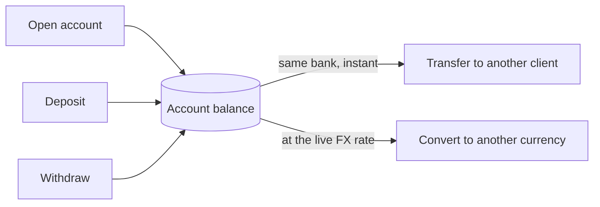
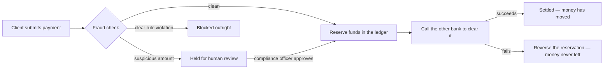
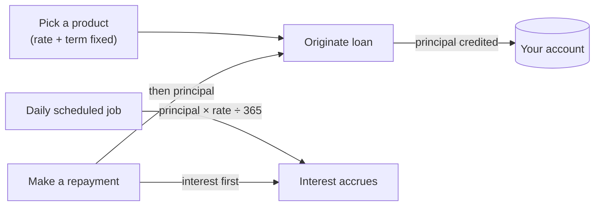
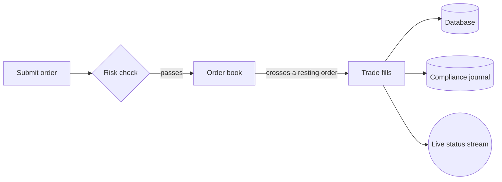
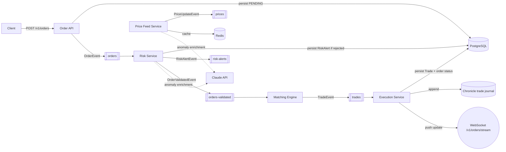
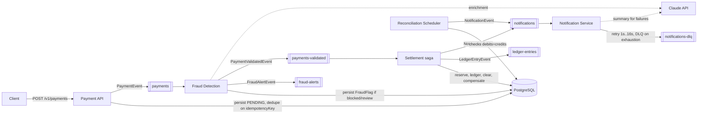

# trading-platform

I built a retail bank that actually runs: open an account, deposit and withdraw money, pay another
customer at the same bank, pay someone at a different bank, take out a loan, convert between
currencies, and trade FX. All of it runs against a real event pipeline (Kafka), a real database
(Postgres), and real security — a client's login can only ever touch their own money, and I can
prove that, not just claim it.

This README explains what it does in plain language first, with pictures. If you want the
engineering deep-dive — architecture tradeoffs, latency numbers, error-recovery table — that's
further down, and also split out into [ARCHITECTURE.md](ARCHITECTURE.md) and the docs linked
throughout.

**Try it yourself:** bring the stack up (see [Quick start](#quick-start)) and open
[`playground.html`](http://localhost:8080/playground.html) — a single page with a button for every
feature below, calling the real running API.

## What it actually does

### Accounts — where the money lives

A client opens an account (checking, savings, or an FX-trading account) in one of six currencies
(USD, EUR, GBP, JPY, CHF, AUD). From there they can deposit, withdraw, send money to another
customer at the same bank, or convert a balance from one currency to another at the live rate.



I made a transfer between two customers at this bank genuinely instant — it's one database write,
debit one account and credit the other, done. There's no multi-step process to fail partway through
because there's no external system involved. That's a deliberate choice, and it's the reason I kept
`TransferService` a completely separate class from `PaymentService` (below) instead of folding them
together — the moment an external system enters the picture, the whole shape of the problem
changes.

### Paying someone at a *different* bank

This is the harder problem, and I treated it as a genuinely different one rather than stretching
the transfer code to cover it: another bank's system is outside my control, and a call to it can
fail, hang, or half-succeed. So instead of one database write, it's a sequence of steps I can undo
if a later step fails:



**The fraud check, and where AI fits in:** three plain rule checks run first — is this client
sending payments unusually fast, did their country change too quickly, is this amount way outside
their normal pattern? Those three rules alone decide whether a payment is clean, held for review,
or blocked. I only ask an AI model (Claude) to *write a one-sentence explanation* of why something
got flagged, after that decision is already made. I did it this way on purpose: I didn't want a
third-party API outage to be able to change whether money moves. If Claude is slow or unreachable,
the payment's fate doesn't change at all — only the explanation text falls back to a plain rule
description instead of an AI sentence. The rules decide; the AI just narrates.

### Loans

Pick from five fixed products (a short personal loan at 9.99%, a 3-year personal loan at 7.49%, a
5-year auto loan at 5.25%, a 10-year student loan at 4.25%, or a 30-year mortgage at 3.75% — rate
and term are locked together per product, not something you type in freehand) and the principal
lands directly in your account. I originally let callers type in any interest rate they wanted, and
it felt wrong the moment I built it — a real bank doesn't let you negotiate your own rate on a
personal loan, so I replaced free-text entry with a fixed catalog. Interest accrues daily on
whatever's still owed — simple interest, not compounding, so it never charges interest on interest
— and a repayment always pays down accrued interest first, then whatever's left goes to principal.



### The FX trading desk

A separate function from everyday banking: submit a buy or sell order on a currency pair (five
pairs are live — EUR/USD, GBP/USD, USD/JPY, USD/CHF, AUD/USD), and if a matching order is resting
on the other side at the same price, they fill each other immediately. I write every fill to three
independent places — the database, a Kafka event, and an off-heap compliance journal that can't be
delayed by a garbage-collection pause — so there's no single point where a trade record could get
lost. I care about that last one specifically because a GC pause is exactly the kind of thing that
silently eats a few hundred milliseconds right when you need a trade recorded.



**Stated plainly, not hidden:** a trade fill does *not* currently move money into your account
balance — it updates the order/trade records, but I haven't wired the FX desk into the same
account-balance system that deposits/transfers/loans use yet. I built the matching engine first to
prove that part worked before connecting it to real money movement, and I ran out of runway before
closing that gap. See [DESIGN_DECISIONS.md](docs/DESIGN_DECISIONS.md) for the full reasoning and
what closing it would take.

## What's real and what's simulated

Everything above runs against real infrastructure and makes real decisions — nothing here is a
canned demo response. But a few pieces are deliberately stand-ins rather than real integrations,
and I'd rather tell you exactly which than have you find out the hard way:

| Piece | Status |
|---|---|
| Fraud rules, ledger, saga, ownership security, interest math, order matching | **Real** — genuine logic, not mocked |
| Claude AI calls | **Real** API calls to the real service (with a safe fallback if no key is configured) — see above |
| Email / Slack notifications | **Simulated** — logged, not sent to a real provider |
| The "other bank" a payment clears against | **Simulated** — a deterministic stand-in (fails above $500k, on purpose, so both outcomes are testable) |
| FX market prices | **Simulated** — a randomized walk, not a real market feed |
| Signup / login | **Real** — `POST /v1/auth/signup`/`/v1/auth/login` create a real user, bcrypt-hash the password, and issue real JWTs as HTTP-only cookies. What's not real: it's a hand-rolled issuer, not a managed identity provider (Auth0/Cognito/Keycloak) — no MFA, password reset, or email verification. |

I picked these specifically because none of them change the interesting parts of the system —
there's no real bank clearing house I can integrate against in a demo, and email delivery is a side
effect at the edge, not the saga logic I actually wanted to prove out. Full reasoning for every
line above, and what real integration would take, in [DESIGN_DECISIONS.md](docs/DESIGN_DECISIONS.md).

## Verified, not just claimed

Everything below I actually ran and checked, not just wrote and assumed would work:

- **131 automated tests pass**, plus a real security test that proves one client's login can't see
  another client's account.
- **Distributed tracing works end-to-end** — I can trace any request through the whole system in
  Jaeger, down to which exact step was slow. I verified this live, and along the way found a real
  Spring Boot 4 bug where tracing was silently a no-op — full story in
  [OBSERVABILITY_PROOF.md](docs/OBSERVABILITY_PROOF.md).
- **Metrics and dashboards work** — Prometheus is scraping 151 real metrics, and Grafana's
  dashboard shows live transfer latency, fraud decisions, and settlement success rate.
- **Load tested for real**: 750 requests across transfers, loan originations, and FX orders, **0
  failures**, transfer p99 latency of 67ms. Real numbers, not targets — in
  [PERFORMANCE_BASELINE.md](docs/PERFORMANCE_BASELINE.md).
- **Running on current stable versions**: Spring Boot 4.1.0, Postgres 18, Kafka 4.3.1, Redis 8 —
  migrated and verified working. The Boot 4 upgrade broke more than I expected (see
  [ARCHITECTURE.md's migration notes](ARCHITECTURE.md#the-spring-boot-4-migration-what-actually-broke)),
  and fixing it caught three genuine bugs I'd rather have found now than in production.

## Quick start

Requires Docker.

```bash
./scripts/local-setup.sh
```

This builds the app and starts Postgres, Redis, Kafka, the API, the frontend, and the observability
stack (Jaeger, Prometheus, Grafana) via `docker-compose`, then waits for `/actuator/health` to
report `UP`. Once ready:

```bash
# The actual frontend — sign up, and everything below is a real button click, not just a curl
open http://localhost:5173

# The interactive playground — a button for every feature in this README
open http://localhost:8080/playground.html

# Swagger API docs
open http://localhost:8080/v1/swagger-ui/index.html

# Traces / metrics / dashboards
open http://localhost:16686   # Jaeger
open http://localhost:9090    # Prometheus
open http://localhost:3000    # Grafana
```

Or drive it directly with `curl`:

```bash
# Open two accounts
curl -s -X POST http://localhost:8080/v1/accounts -H 'Content-Type: application/json' \
  -d '{"clientId":"alice","accountType":"CHECKING","currency":"USD","openingBalance":1000.00}'
curl -s -X POST http://localhost:8080/v1/accounts -H 'Content-Type: application/json' \
  -d '{"clientId":"bob","accountType":"CHECKING","currency":"USD","openingBalance":0.00}'

# Deposit, then transfer to another client (both at this bank — instant, no saga)
curl -s -X POST http://localhost:8080/v1/accounts/{aliceAccountId}/deposit -H 'Content-Type: application/json' \
  -d '{"amount":200.00}'
curl -s -X POST http://localhost:8080/v1/transfers -H 'Content-Type: application/json' \
  -d '{"fromAccountId":"{aliceAccountId}","toAccountId":"{bobAccountId}","amount":100.00}'

# See the loan product catalog, then take one out (product picks the rate/term, not you)
curl -s http://localhost:8080/v1/loans/products
curl -s -X POST http://localhost:8080/v1/loans -H 'Content-Type: application/json' \
  -d '{"clientId":"alice","accountId":"{aliceAccountId}","principal":5000.00,"productType":"PERSONAL_SHORT"}'
curl -s http://localhost:8080/v1/loans/{loanId}

# Submit a sell, then a matching buy on the FX desk — they fill each other
curl -s -X POST http://localhost:8080/v1/orders -H 'Content-Type: application/json' \
  -d '{"clientId":"seller-1","currencyPair":"EUR/USD","side":"SELL","quantity":10,"price":1.08}'
curl -s -X POST http://localhost:8080/v1/orders -H 'Content-Type: application/json' \
  -d '{"clientId":"buyer-1","currencyPair":"EUR/USD","side":"BUY","quantity":10,"price":1.08}'
curl -s http://localhost:8080/v1/orders/{orderId}

# Submit a payment to another bank and watch it settle
curl -s -X POST http://localhost:8080/v1/payments -H 'Content-Type: application/json' \
  -d '{"clientId":"payer-1","sourceAccountId":"{someAccountId}","amount":250.00,"idempotencyKey":"demo-1","country":"US"}'
curl -s http://localhost:8080/v1/payments/{paymentId}
```

The `dev` profile (active by default in `docker-compose.yml`) disables JWT enforcement so these
`curl` calls work without minting a token first — see [Security](#security).

To run locally without Docker: start Postgres/Redis/Kafka yourself and run
`mvn spring-boot:run` (Chronicle Queue needs the JVM `--add-opens` flags already wired into the
Maven build — see `pom.xml`'s `chronicle.jvm.opens` property).

---

## For engineers: architecture, tradeoffs, and operations

### Architecture diagram





### Components & responsibilities

| Component | Responsibility |
|---|---|
| Order API | Validate, persist, publish, stream status |
| Risk Service | Notional + order-velocity limit checks |
| Matching Engine | Price/time-priority matching per currency pair |
| Execution Service | Sole writer of trade + order-status truth |
| Trade Journal | Immutable, off-heap, replayable audit log |
| Price Feed Service | Synthetic ticks (stand-in for a real feed), anomaly detection, FX rate lookup for conversion |
| Payment API | Idempotent intake, validate, publish (cross-bank payments) |
| Fraud Detection Service | Velocity / country-change / amount-anomaly rules |
| Settlement Service | Saga orchestrator: reserve → ledger → clear → compensate |
| Ledger Service | Immutable double-entry bookkeeping, reversal on compensation |
| Notification Service | Retry with real backoff, DLQ on exhaustion, AI summary for failures |
| Reconciliation Service | Ledger integrity check per settled payment |
| Account Service | Open/lookup accounts, deposit, withdraw, FX conversion between own accounts |
| Transfer Service | Same-bank transfers between clients (atomic, no saga) |
| Loan Service | Origination, repayment (interest-first), scheduled interest accrual |

### Design tradeoffs

I tried to be honest with myself about every one of these while building it — each row is a real
decision I made, why I made it, and what I gave up by making it.

| Decision | Why | Tradeoff accepted |
|---|---|---|
| Per-currency-pair synchronized order book instead of a wait-free multi-pair structure | Correctness of price/time priority is non-negotiable; different pairs never contend | Matching for the *same* pair is serialized, not lock-free |
| Raw `KafkaConsumer` poll loop for the Matching Engine instead of `@KafkaListener` | Keeps the hot path free of listener-container overhead, matches the batch-poll pattern directly | More manual lifecycle code than a declarative listener |
| Thread affinity (CPU pinning) implemented but disabled by default | Needs a native JNI library, not portable across every dev machine/container | Sub-5ms matching latency claim is unverified without it enabled and benchmarked |
| Synthetic price feed instead of a real market data integration | No real feed exists | Anomaly detection triggers on synthetic data, not real market events |
| Claude API wired for real (fraud/anomaly enrichment, notification summaries, Game Mode debrief), but purely advisory | Rule-based checks (threshold, velocity) already gate correctness; AI enrichment is a "why" narrative, not a decision-maker | If `CLAUDE_API_KEY` is unset, alerts and notifications still fire — just without the AI-written explanation |
| `SettlementService` is a saga orchestrator, not choreographed via extra Kafka hops | Keeps the compensation logic in one reviewable place instead of spread across consumers | Differs from a literal reading of the spec's separate "Ledger Service consumes payment events" |
| `BankClearingClientImpl` deterministically fails above a configurable amount | No real bank gateway exists; this is a test seam so compensation is actually exercised, not a business rule | The threshold is arbitrary, not a real risk limit |
| Email/Slack are logging stand-ins that never fail | No real provider exists to fail against; a contrived failure condition would be worse than an honest stand-in | Retry/DLQ wiring is proven correct by unit test (exception propagation), not by an end-to-end failure in practice |
| Reconciliation checks internal ledger integrity, not a real bank statement | No external bank feed exists | Catches "my own bookkeeping is wrong," not "the bank disagrees with me" |
| `dev` Spring profile disables JWT enforcement | Lets the API be exercised locally without a token-minting step | Must never be the active profile outside local development |
| Ownership checks (`CallerPrincipal`) live in the service layer, resolved explicitly from the controller — not read from a static `SecurityContextHolder` inside services | Keeps services trivially unit-testable (construct a fake `CallerPrincipal`); `@PreAuthorize` alone only proves *some* client is calling, not that they own the specific resource | An extra parameter threaded through every client-facing service method, instead of an ambient lookup |
| FX order execution doesn't move `Account.balance` | Wiring the matching engine into real settlement is a further follow-on beyond this pass's scope | An `FX_TRADING` account's balance reflects deposits/conversions/transfers, not fills from its own orders yet |

### Performance

Real Gatling numbers — not my design target, the actual measured result — from
[PERFORMANCE_BASELINE.md](docs/PERFORMANCE_BASELINE.md):

| Scenario | Requests | Failures | p50 | p95 | p99 |
|---|---|---|---|---|---|
| Internal transfers (50 users) | 350 | 0 | 10ms | 29ms | 67ms |
| Loan origination (5/sec) | 200 | 0 | 15ms | 156ms | 966ms |
| FX order submission (10/sec) | 200 | 0 | 18ms | 99ms | 713ms |

I ran these on a single Docker Desktop VM sharing CPU with 6 other containers, so this is a
host-constrained floor, not a tuned ceiling — I don't want to oversell a laptop benchmark as a
capacity plan. Commands to run at full scale (1,000 users / 100 orders-per-sec) against dedicated
infrastructure are in the same doc.

### Error scenarios & recovery

| Failure | Behavior |
|---|---|
| Order/Payment API crashes after publish, before responding | Event already in Kafka; client retries — payments are idempotent on `idempotencyKey`, matching is idempotent on `orderId` |
| Any consuming service crashes (Risk, Matching, Execution, Fraud, Settlement, Reconciliation) | Kafka retains the record; consumer resumes from last committed offset on restart, nothing is lost |
| Kafka unavailable | A failed publish is queued in a bounded in-memory fallback buffer (`KafkaEventPublisher`) and retried on a schedule — a single-instance safety net for a transient outage, not a durable store; queued events are lost on restart |
| Postgres unavailable | Submission fails (write path); already-queued Kafka events are retried once Postgres recovers |
| Bank clearing fails | Ledger entries reversed, payment marked `FAILED`, customer notified with the reason — see [docs/PAYMENT_SYSTEM.md](docs/PAYMENT_SYSTEM.md) |
| A payment is flagged `UNDER_REVIEW` | Held until a `COMPLIANCE_OFFICER` calls `POST /v1/payments/{id}/approve` or `/reject` |
| Notification delivery fails | Retried at 1s/2s/4s/8s/16s; exhausted retries land on `notifications-dlq`, recorded `DEAD_LETTERED` |
| Claude API unavailable or unset | Alerts and notifications still fire using the plain rule-based reason; AI enrichment is skipped, never required |
| Redis unavailable | Price feed falls back to the last known seed price per currency pair; trading itself doesn't depend on Redis; FX conversion fails with `RateUnavailableException` if no rate is cached |
| A client's token is used against another client's account/payment/transfer/loan | `AccessDeniedException` → 403 — see [docs/ACCOUNTS.md](docs/ACCOUNTS.md#3-ownership-security) |
| Kafka topic metadata not yet cached for a fresh topic | Producer send is capped at 3s (not Kafka's 60s default) and falls back to the same retry queue as a broker outage — a real bug I found and fixed, see [docs/KAFKA_SETUP.md](docs/KAFKA_SETUP.md) |

### Observability

Full write-up with real trace IDs and metric values: [OBSERVABILITY_PROOF.md](docs/OBSERVABILITY_PROOF.md).

- **Tracing**: Jaeger at `:16686`, every HTTP request and scheduled task instrumented via
  Micrometer Observation, exported over OTLP. I hit a genuine Spring Boot 4.1.0 gap here — neither
  of Boot 4's two tracing autoconfiguration modules actually wires the `Tracer` bean, so spans were
  silently discarded until I wrote `TracingConfig.java` to fill in the missing piece myself.
- **Metrics**: Prometheus at `:9090`, scraping `/actuator/prometheus` — 151 metrics including
  custom business ones (`transfer_latency_seconds`, `fraud_detection_latency_seconds`,
  `payment_settlement_outcome_total`, `fx_trades_total`, `kafka_consumer_lag`).
  Five alert rules (`docker/prometheus/alerts.yml`) — transfer latency, payment success rate,
  fraud-detection latency, Kafka consumer lag, DB connection pool exhaustion.
- **Dashboards**: Grafana at `:3000`, `Banking Platform` dashboard auto-provisioned, verified
  showing real data for every panel.

### API documentation

Swagger UI: `/v1/swagger-ui/index.html`. OpenAPI JSON: `/v1/api-docs`.

### Security

- JWT bearer auth (HS256, roles `CLIENT` / `TRADER` / `ADMIN` / `AUDITOR` / `COMPLIANCE_OFFICER`)
  enforced via `@PreAuthorize` on every endpoint, in every profile.
- Role checks alone aren't enough for a bank, and I don't think that's obvious until you say it out
  loud: any `CLIENT` token passes `@PreAuthorize`, but that only proves *someone* is a client, not
  that they own the specific account being read or acted on. I closed that gap with
  `CallerPrincipal` — every account/payment/transfer/loan endpoint checks that the caller's JWT
  identity matches the resource's `clientId` (staff roles may act across clients). See
  [docs/ACCOUNTS.md §3](docs/ACCOUNTS.md#3-ownership-security).
- The `dev` profile additionally grants every role to the anonymous principal and permits all HTTP
  requests, so `@PreAuthorize` still runs the same code path as production — it just doesn't
  require a token locally. **Never run `dev` outside local development.**
- Signup/login (`POST /v1/auth/signup`, `/v1/auth/login`) mint real JWTs — HTTP-only, `SameSite=Strict`
  cookies, never `localStorage` — with bcrypt-hashed passwords and one-time-use refresh-token
  rotation; see [What's real and what's simulated](#whats-real-and-what-simulated) for what's not
  built yet (a real OAuth2/OIDC IdP).
  No secrets are committed; `JWT_SECRET` and `CLAUDE_API_KEY` are environment
  variables with local-only placeholder defaults.

### Test coverage — stated honestly

Unit tests cover every service's business logic (mocked dependencies) plus the order-book matching
algorithm directly. One Testcontainers integration test proves the ownership-security check through
the *real* JWT filter chain (`AccountSecurityIntegrationTest`: a client's token gets a genuine 403
reading another client's account) against real Kafka/Postgres/Redis. I'm not going to claim this is
100% line coverage or a verified SonarQube grade, because it isn't. Known gaps: the Claude API's
success paths (the failure/fallback path *is* tested — mocking WebFlux's fluent client reliably
for the success case felt disproportionate to the payoff), `@PreAuthorize` role
enforcement itself (controller unit tests bypass Spring Security entirely by design — only the
ownership-check layer on top of it is proven end-to-end), and two Testcontainers-based end-to-end
pipeline tests (order→trade, payment→settlement) I removed after they proved flaky specifically in
the Testcontainers networking environment, not in the application itself.

## All the docs

| Doc | Covers |
|---|---|
| [ARCHITECTURE.md](ARCHITECTURE.md) | Full system design |
| [docs/ACCOUNTS.md](docs/ACCOUNTS.md) | Accounts, transfers, conversion, loans, ownership security |
| [docs/PAYMENT_SYSTEM.md](docs/PAYMENT_SYSTEM.md) | Cross-bank payment lifecycle and saga |
| [docs/TRADING_SYSTEM.md](docs/TRADING_SYSTEM.md) | Order lifecycle and matching algorithm |
| [docs/DESIGN_DECISIONS.md](docs/DESIGN_DECISIONS.md) | What's real vs. simulated, and why, in full |
| [docs/OBSERVABILITY_PROOF.md](docs/OBSERVABILITY_PROOF.md) | Live-verified tracing/metrics/dashboards, with real data |
| [docs/PERFORMANCE_BASELINE.md](docs/PERFORMANCE_BASELINE.md) | Real Gatling load-test results |
| [docs/OPERATIONS.md](docs/OPERATIONS.md) | Runbooks, on-call procedures, alert thresholds |
| [docs/KAFKA_SETUP.md](docs/KAFKA_SETUP.md) | Topic provisioning, and a real bug I found/fixed |
| [docs/INTERVIEW_TALKING_POINTS.md](docs/INTERVIEW_TALKING_POINTS.md) | Verified, confident answers to the questions this project invites |
| [HANDOFF.md](HANDOFF.md) | Point-in-time status snapshot |

## Roadmap

- **Done**: the full retail-banking domain (accounts, deposits/withdrawals, internal transfers, FX
  conversion, loans) with ownership-checked security; real signup/login (bcrypt, JWT issuance,
  refresh-token rotation); a React/TypeScript frontend for all of it; Kafka-down fallback queue;
  compliance-officer approval workflow; Kubernetes manifests + Helm chart (verified on a local
  `kind` cluster); distributed tracing, metrics, and dashboards (verified live); Gatling load tests
  (verified, real numbers); Postgres/Kafka/Redis on latest stable versions.
- **Remaining**: real SendGrid/Slack/bank-gateway integrations, wiring FX trade fills to move
  account balances, a real GCP Cloud Run deployment (the pipeline is written but untested — I don't
  have cloud credentials in this environment), GCP Secret Manager/KMS for secrets, fronting the
  hand-rolled JWT issuer with a real OAuth2/OIDC identity provider.

## Contributing

Standard PR flow: branch, `mvn verify` must pass, follow the
[coding standards](https://github.com/Dcbate/Oracle/blob/main/documentation/CodingStandards.md)
(Controller-Service-Repository, interfaces on every service, JUnit5+Mockito, no nulls).
