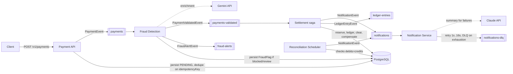

# trading-platform

Real-time trading and payment-processing platform. **Phase 1 + 2 (this repo, today): the trading
system and the payment system** — order intake, risk checks, matching, execution, and a
compliance trade journal; payment intake, fraud detection, a settlement saga with compensation,
double-entry ledgering, retrying notifications, and reconciliation — all running end-to-end
against real Kafka, PostgreSQL, and Redis. Kubernetes/Helm deployment and the full observability
stack are Phase 3 (see [Roadmap](#roadmap)).

## Problem statement

Traders need orders executed in well under 100ms or they lose money. Orders can't be lost or
silently duplicated. Payments can't be charged twice, can't disappear, and every trade and
payment has to be reconstructable for compliance after the fact — the system has to keep working
through spikes, crashes, and network failures.

## Solution overview

Orders flow through five stages, each independently scalable and each recoverable from Kafka if
it crashes:

```
Order API → [orders] → Risk Service → [orders-validated] → Matching Engine → [trades] → Execution Service
                                                                                              │
                                                                                    Postgres + Chronicle journal
```

- **Order API** validates and accepts orders, returns immediately, streams status over WebSocket.
- **Risk Service** rejects orders that breach per-client notional or velocity limits.
- **Matching Engine** holds an in-memory, price/time-priority order book per symbol and matches
  crossing orders.
- **Execution Service** is the single writer of trade outcomes: persists the trade, updates order
  status, and appends to the off-heap trade journal.
- **Price Feed Service** stands in for a real market data feed (none exists) and flags anomalous
  moves.

Payments follow the same event-driven shape, ending in a saga rather than a matching engine:

```
Payment API → [payments] → Fraud Detection → [payments-validated] → Settlement (saga) → [notifications] → Notification Service
                                                                          │
                                                              Ledger (double-entry) + compensation on failure
```

- **Payment API** is idempotent on `idempotencyKey` — a resubmitted key returns the existing
  payment rather than double-charging.
- **Fraud Detection Service** blocks on velocity or fast country-change, sends amount anomalies
  for review.
- **Settlement Service** orchestrates reserve → ledger → bank-clear → compensate as one saga.
- **Ledger Service** writes immutable double-entry rows; a failed clearing writes *reversing*
  entries, never edits or deletes.
- **Notification Service** retries failed deliveries with real exponential backoff
  (`@RetryableTopic`, 1s→16s) before landing on a dead-letter topic.
- **Reconciliation Service** checks every settled payment's ledger entries actually net to zero.

See [ARCHITECTURE.md](ARCHITECTURE.md) for the full design,
[docs/TRADING_SYSTEM.md](docs/TRADING_SYSTEM.md) for the order lifecycle and matching algorithm,
and [docs/PAYMENT_SYSTEM.md](docs/PAYMENT_SYSTEM.md) for the payment lifecycle and saga in detail.

## Quick start

Requires Docker.

```bash
./scripts/local-setup.sh
```

This builds the app and starts Postgres, Redis, Kafka, and the API via `docker-compose`, then
waits for `/actuator/health` to report `UP`. Once ready:

```bash
# API docs
open http://localhost:8080/v1/swagger-ui.html

# Submit a sell, then a matching buy
curl -s -X POST http://localhost:8080/v1/orders -H 'Content-Type: application/json' \
  -d '{"clientId":"seller-1","symbol":"AAPL","side":"SELL","quantity":10,"price":150.00}'
curl -s -X POST http://localhost:8080/v1/orders -H 'Content-Type: application/json' \
  -d '{"clientId":"buyer-1","symbol":"AAPL","side":"BUY","quantity":10,"price":150.00}'

# Check the resulting fill
curl -s http://localhost:8080/v1/orders/{orderId}

# Submit a payment and watch it settle
curl -s -X POST http://localhost:8080/v1/payments -H 'Content-Type: application/json' \
  -d '{"clientId":"payer-1","amount":250.00,"idempotencyKey":"demo-1","country":"US"}'
curl -s http://localhost:8080/v1/payments/{paymentId}
```

The `dev` profile (active by default in `docker-compose.yml`) disables JWT enforcement so these
`curl` calls work without minting a token first — see [Security](#security).

To run locally without Docker: start Postgres/Redis/Kafka yourself and run
`mvn spring-boot:run` (Chronicle Queue needs the JVM `--add-opens` flags already wired into the
Maven build — see `pom.xml`'s `chronicle.jvm.opens` property).

## Architecture diagram




## Components & responsibilities

| Component | Responsibility |
|---|---|
| Order API | Validate, persist, publish, stream status |
| Risk Service | Notional + order-velocity limit checks |
| Matching Engine | Price/time-priority matching per symbol |
| Execution Service | Sole writer of trade + order-status truth |
| Trade Journal | Immutable, off-heap, replayable audit log |
| Price Feed Service | Synthetic ticks (stand-in for a real feed), anomaly detection |
| Payment API | Idempotent intake, validate, publish |
| Fraud Detection Service | Velocity / country-change / amount-anomaly rules |
| Settlement Service | Saga orchestrator: reserve → ledger → clear → compensate |
| Ledger Service | Immutable double-entry bookkeeping, reversal on compensation |
| Notification Service | Retry with real backoff, DLQ on exhaustion, AI summary for failures |
| Reconciliation Service | Ledger integrity check per settled payment |

## Design tradeoffs

| Decision | Why | Tradeoff accepted |
|---|---|---|
| Per-symbol synchronized order book instead of a wait-free multi-symbol structure | Correctness of price/time priority is non-negotiable; different symbols never contend | Matching for the *same* symbol is serialized, not lock-free |
| Raw `KafkaConsumer` poll loop for the Matching Engine instead of `@KafkaListener` | Keeps the hot path free of listener-container overhead, matches the batch-poll pattern directly | More manual lifecycle code than a declarative listener |
| Thread affinity (CPU pinning) implemented but disabled by default | Needs a native JNI library, not portable across every dev machine/container | Sub-5ms matching latency claim is unverified without it enabled and benchmarked |
| Synthetic price feed instead of a real market data integration | No real feed exists for Phase 1 | Anomaly detection triggers on synthetic data, not real market events |
| Gemini API wired for real, but purely advisory | Rule-based checks (threshold, velocity) already gate correctness; AI enrichment is a "why" narrative, not a decision-maker | If `GEMINI_API_KEY` is unset, alerts still fire — just without the AI-written explanation |
| Claude API wired for real, but purely advisory | Same reasoning as Gemini, for notification summaries | If `CLAUDE_API_KEY` is unset, notifications still send with the plain reason text |
| `SettlementService` is a saga orchestrator, not choreographed via extra Kafka hops | Keeps the compensation logic in one reviewable place instead of spread across consumers | Differs from a literal reading of the spec's separate "Ledger Service consumes payment events" |
| `SimulatedBankClearingClient` deterministically fails above a configurable amount | No real bank gateway exists; this is a test seam so compensation is actually exercised, not a business rule | The threshold is arbitrary, not a real risk limit |
| Email/Slack are logging stand-ins that never fail | No real provider exists to fail against; a contrived failure condition would be worse than an honest stand-in | Retry/DLQ wiring is proven correct by unit test (exception propagation), not by an end-to-end failure in practice |
| Reconciliation checks internal ledger integrity, not a real bank statement | No external bank feed exists | Catches "our own bookkeeping is wrong," not "the bank disagrees with us" — that's Phase 3 |
| `dev` Spring profile disables JWT enforcement | Lets the API be exercised locally without a token-minting step | Must never be the active profile outside local development |

## Latency

The spec's targets (order→Kafka <10ms, matching <5ms, p99 <100ms) describe what this design is
*built for* — the lock-free-per-symbol book, virtual threads, and batched Kafka consumption all
exist for that reason. **They have not been load-tested.** Gatling load tests are a Phase 3 item;
until then, treat the targets as design intent, not a measured SLA.

## Error scenarios & recovery

| Failure | Behavior |
|---|---|
| Order/Payment API crashes after publish, before responding | Event already in Kafka; client retries — payments are idempotent on `idempotencyKey`, matching is idempotent on `orderId` |
| Any consuming service crashes (Risk, Matching, Execution, Fraud, Settlement, Reconciliation) | Kafka retains the record; consumer resumes from last committed offset on restart, nothing is lost |
| Kafka unavailable | Submission fails fast (publish error is logged); no in-memory fallback queue yet — see Roadmap |
| Postgres unavailable | Submission fails (write path); already-queued Kafka events are retried once Postgres recovers |
| Bank clearing fails | Ledger entries reversed, payment marked `FAILED`, customer notified with the reason — see [docs/PAYMENT_SYSTEM.md](docs/PAYMENT_SYSTEM.md) |
| Notification delivery fails | Retried at 1s/2s/4s/8s/16s; exhausted retries land on `notifications-dlq`, recorded `DEAD_LETTERED` |
| Gemini/Claude API unavailable or unset | Alerts and notifications still fire using the plain rule-based reason; AI enrichment is skipped, never required |
| Redis unavailable | Price feed falls back to the last known seed price per symbol; trading itself doesn't depend on Redis |

## API documentation

Swagger UI: `/v1/swagger-ui.html`. OpenAPI JSON: `/v1/api-docs`.

## Security

- JWT bearer auth (HS256, roles `TRADER` / `ADMIN` / `AUDITOR` / `COMPLIANCE_OFFICER`) enforced
  via `@PreAuthorize` on every endpoint, in every profile.
- The `dev` profile additionally grants those roles to the anonymous principal and permits all
  HTTP requests, so `@PreAuthorize` still runs the same code path as production — it just
  doesn't require a token locally. **Never run `dev` outside local development.**
- No secrets are committed. `JWT_SECRET`, `GEMINI_API_KEY`, and `CLAUDE_API_KEY` are environment
  variables with local-only placeholder defaults; production would source all three from GCP
  Secret Manager (Phase 3).

## Monitoring

`/actuator/health` (includes a custom order-book-depth indicator), `/actuator/prometheus`
(Micrometer metrics, including a `price.anomalies` counter). Structured JSON dashboards, Jaeger
tracing, and alert rules are Phase 3.

## Test coverage — stated honestly

Unit tests cover every service's business logic (mocked dependencies) plus the order-book
matching algorithm directly. Two Testcontainers integration tests prove the full pipelines —
order→trade, and payment→fraud-pass→settlement→ledger, including the compensation path via a
deliberately-oversized payment — against real Kafka/Postgres/Redis. This is **not** literal 100%
line coverage or a verified SonarQube grade — those require tooling this environment doesn't run.
Known gaps: the Gemini/Claude APIs' success paths (mocking WebFlux's fluent client reliably is
disproportionate to the payoff; the failure/fallback path *is* tested for both), `@PreAuthorize`
enforcement itself (controller unit tests bypass Spring Security entirely by design), and the
Notification retry mechanism's actual timing (proven by unit test that failures propagate
correctly for `@RetryableTopic` to act on, not by a ~31-second end-to-end backoff observation).

## Roadmap

- **Phase 3**: Kubernetes + Helm, GCP Secret Manager/KMS, GitHub Actions deploy pipeline, Jaeger tracing, Grafana dashboards, Gatling load tests, BigQuery analytics streaming, in-memory Kafka-down fallback queue, real SendGrid/Slack/bank-gateway integrations, compliance-officer approval workflow for `UNDER_REVIEW` payments

## Contributing

Standard PR flow: branch, `mvn verify` must pass, follow the
[coding standards](https://github.com/Dcbate/Oracle/blob/main/documentation/CodingStandards.md)
(Controller-Service-Repository, interfaces on every service, JUnit5+Mockito, no nulls).
