# Tech Stack — System Design & Interview Study Guide

This is your study sheet. Not a project brag-sheet — a **learning document**: for every piece of
technology in this project, you get what it *is* in plain English, why a real system reaches for
it, what we specifically built with it, and where to go read more if you want depth beyond an
interview answer. This is written to be your first pass at system-design-interview vocabulary, using
a real codebase you built as the anchor for each concept instead of an abstract example.

The UI (React/frontend) is intentionally left out — this guide is backend/systems-focused, which is
where system design questions live.

For narrative "walk me through X" rehearsal, see
[INTERVIEW_TALKING_POINTS.md](INTERVIEW_TALKING_POINTS.md) — that's Q&A-style practice. This doc is
the concept-by-concept reference you study *before* that.

Every fact below is checked against the running code, not memory or an old plan.

## How to use this

1. Read **Part 1 (System Design Concepts)** first, even the patterns we didn't build — these are
   the vocabulary words that come up in almost every system design interview regardless of company.
2. Read **Part 2 (Containers 101)** next if Docker/Kubernetes is still fuzzy — it's the plumbing
   everything else runs on.
3. The rest is reference: read a section when you want to go deeper on that one piece, or skim all
   of it once so you know what's here.
4. Every pattern in Part 1, plus records and virtual threads from Part 3, also has a small,
   runnable example test in `src/test/java/com/dcbate/tradingplatform/systemdesign/` — not tests
   of the banking domain, just the mechanism in isolation with toy data. Run one
   (`mvn test -Dtest=CircuitBreakerExampleTest`, for instance), read it top to bottom, then step
   through it in a debugger — that's the fastest way to make a pattern actually stick beyond the
   words on this page.

## The one question to ask about every tool in this doc

Every section below answers the same three questions, explicitly, because this is the thing that's
easy to stay fuzzy on even after using a tool for months:

1. **What kind of *thing* is it, physically?** — a plain config file sitting on disk? A
   command-line program? A library baked directly into our app's JAR, running in the same process?
   Or a genuinely separate running server our app talks to over the network?
2. **How do we actually invoke it?** — a shell command we type, an annotation the framework reads,
   a request that goes out over HTTP/TCP at runtime?
3. **What's the concrete, physical outcome?** — a running container? Rows written to a table? A
   file on disk? Bytes sent over a socket?

Worked example, since this is the one that's genuinely confusing at first — **Docker Compose**:

- **What it is**: two separate things people bundle together in their head as one. `docker-compose.yml`
  is *just a YAML file* — plain text, does nothing by itself, describes the desired end state
  ("I want a container from this image, on this network, with these environment variables"). `docker
  compose` is a *separate command-line program* (ships with Docker Desktop / Docker Engine) that
  reads that YAML.
- **How we invoke it**: we type `docker compose -f docker/docker-compose.yml up -d` in a terminal.
- **What actually happens, step by step**: the `docker compose` CLI parses the YAML, then talks to
  the **Docker Engine** (a background daemon process, `dockerd`, that does the real work) over its
  API. For each `image:` line, Docker Engine pulls that image from Docker Hub if it isn't already
  on disk. For each `build:` line, it runs the multi-stage build described in Part 2 and produces a
  new local image. It then creates one **virtual network** and, for every service in the file,
  creates and starts one **container**, attaching each to that network under its service name as a
  DNS hostname — which is the entire reason `app` can reach the database by writing
  `jdbc:postgresql://postgres:5432/trading` instead of a real IP address.
- **The concrete outcome you can go check**: run `docker ps` afterward and you'll see 9 actual
  running processes (one per service) on this machine — that's the tangible result of one YAML file
  plus one command.

Every section from here on gets the same treatment, just more briefly.

---

# Part 1 — System Design Concepts

These are the patterns interviewers ask about across almost any backend system, not just this one.
Each one below says whether we actually built it, and if we didn't, what it would take.

## Layered architecture (Controller → Service → Repository)

**What it is, plainly**: split your code into layers that each do one job and only talk to the
layer directly below them. A **Controller** receives an HTTP request and turns it into a method
call. A **Service** holds the actual business logic ("can this loan be approved?"). A
**Repository** is the only thing that talks to the database. The Controller never touches the
database directly, and the Service never parses HTTP itself.

**Why it matters**: it's the difference between a codebase where a bug fix touches one file and one
where it touches ten. If validation logic is duplicated across five controllers because there's no
service layer underneath them, that's the smell this pattern exists to prevent.

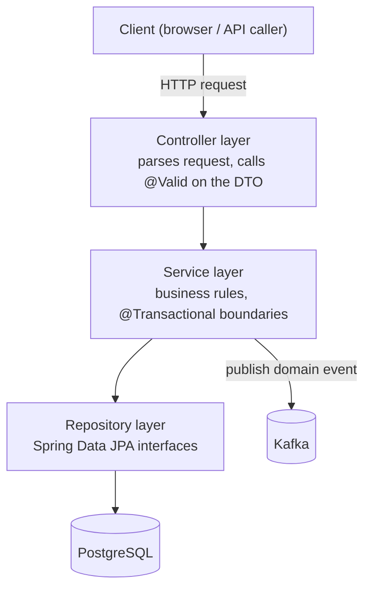

**What we built**: every feature in this app — accounts, loans, payments, trading, Game Mode —
follows this exact shape. `AccountController` → `AccountServiceImpl` → `AccountRepository`, and so
on for every domain.

**Learn more**: [Martin Fowler's "Presentation Domain Data Layering"](https://martinfowler.com/bliki/PresentationDomainDataLayering.html)
is the canonical, framework-agnostic explanation of exactly this split and *why* it helps —
Fowler's actual point is that it reduces how much you have to hold in your head at once, not just
that it's "good practice." [Spring's own guides](https://spring.io/guides) are worth a browse too
if you want to see the same shape explained framework-first, with real Spring code.

## Event-driven architecture

**What it is, plainly**: instead of Service A directly calling Service B over HTTP, Service A drops
a message ("payment submitted") onto a queue. Service B — and C, and D — picks it up whenever it's
ready. Nobody waits on anybody.

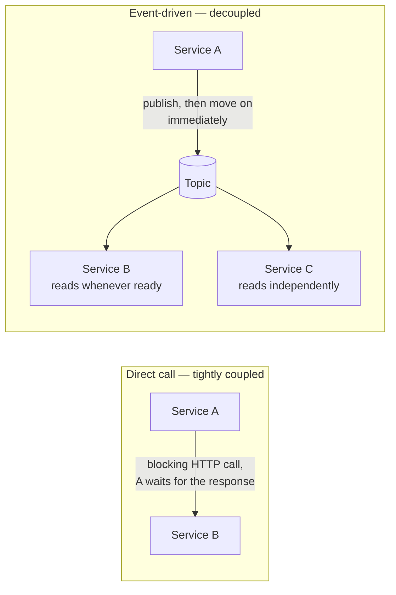

**Why it matters**:

- If the fraud-checking service is down or slow, the payment-submission API doesn't hang waiting
  for it — the message just sits in the topic until the consumer catches up.
- It's how most real large systems are actually built, banks included: many small things reacting
  to events, not one big program doing everything inline, start to finish, in a single call stack.

**What we built**: this is the whole point of the Kafka section below (Part 6) — 14 topics, two
independent event chains, with a full anatomy diagram of exactly how a message moves.

**Learn more**: [Jay Kreps' "The Log"](https://engineering.linkedin.com/distributed-systems/log-what-every-software-engineer-should-know-about-real-time-datas-unifying)
is the single best piece on this — written by one of Kafka's actual creators, explaining why an
append-only log turns out to be the right abstraction underneath almost every distributed system,
not just Kafka. Long, but genuinely the article that made this idea click for a generation of
engineers.

## The Saga pattern — **we did build this**

**What it is, plainly**: when one business operation needs to touch multiple systems that can't all
be inside one database transaction (e.g. "debit our ledger" + "call an external bank"), you can't
just wrap it in `BEGIN/COMMIT` — a normal transaction can't span two separate systems. A **saga**
is the answer: you do the steps one at a time, and if a later step fails, you run **compensating**
actions to undo the steps that already succeeded, so the system ends up consistent even though
there was no single all-or-nothing transaction covering the whole thing.

There are two flavors: **choreographed** (each service reacts to the previous step's event, no
central coordinator) and **orchestrated** (one service explicitly drives every step and decides
when to compensate). We used orchestrated — deliberately, because it keeps the compensation logic
in one reviewable place instead of scattered across several Kafka consumers.

**Our real example**: `SettlementServiceImpl.process()` — a cross-bank payment. It reserves the
payment, books ledger entries, then calls an external bank-clearing gateway. If the external call
fails, it runs a compensating action (`ledgerService.reverseEntries()`) so the books net back to
zero — the payment never gets stuck half-processed.

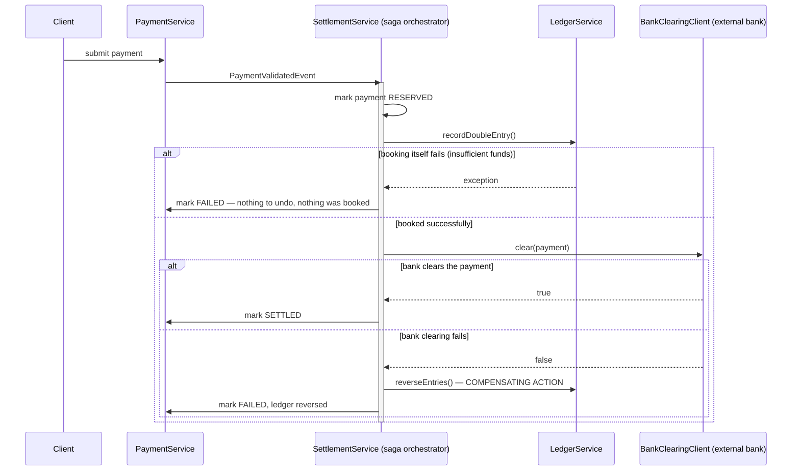

Notice the pattern isn't hypothetical here: `BankClearingClientImpl` is deliberately built to fail
above a configurable amount specifically so this compensation path is exercisable and tested, not
just theoretical.

Worth contrasting with a same-bank transfer, which does **not** need a saga:
`TransferServiceImpl` debits one account and credits the other inside one plain `@Transactional`
method, because both accounts live in the same database — there's nothing external that can
partially fail, so a normal transaction is enough. Knowing *when* you need a saga versus a plain
transaction is the actual interview point.

**Learn more**: [microservices.io's Saga pattern reference](https://microservices.io/patterns/data/saga.html)
is the canonical write-up (orchestration vs. choreography, compensating transactions).

## The Circuit Breaker pattern — **we did build this**

**What it is, plainly**: if a downstream service is failing, retrying it over and over just makes
things worse — you're hammering an already-struggling service, and every caller is now waiting on
a slow timeout instead of failing fast. A circuit breaker tracks recent failures, and once they
cross a threshold, it "trips" — for a cooldown period, it stops calling the downstream service at
all and fails immediately (or returns a fallback), giving the struggling service room to recover.
After the cooldown, it lets a few trial requests through; if they succeed, it closes again; if they
fail, it stays open for another cooldown.

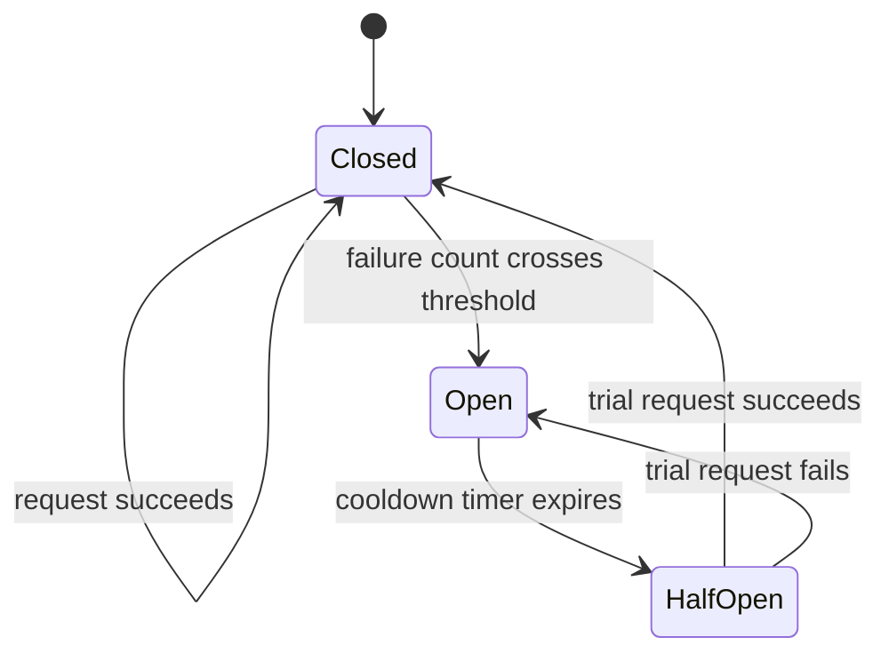

**What it is, mechanically**: **Resilience4j**, wired by hand as two plain `@Bean`s
(`config/ResilienceConfig.java`) rather than its Spring Boot 3 autoconfigured starter — this
project has already found two real Boot-4-compatibility gaps in starters that looked like they
should just work (Kafka, tracing — Part 3), so the core library + a small config class sidesteps
that risk entirely. Each of the two genuine external-dependency call sites —
`ai/mcp/McpToolClient` (a real network hop to `bate-mcp-server`) and
`payment/service/BankClearingClientImpl` (stands in for a real bank gateway) — wraps its call in
`circuitBreaker.executeSupplier(...)`. Config: a 10-call sliding window, evaluated once at least 5
calls have happened, tripping at a 50% failure rate, staying open for 30 seconds, then letting 3
trial calls through before deciding whether to fully close or reopen.

**A genuinely important design decision, not a default**: only a *thrown exception* counts as a
failure — a call that returns normally, even with a "business" `false`, counts as success.
`BankClearingClientImpl`'s deterministic "declined above threshold" return is a normal outcome, not
a sign the gateway is unhealthy, and must never trip the breaker on its own — proven with a test
(`repeatedBusinessDeclinesNeverTripTheBreaker`) that fires 10 straight declines through a breaker
and asserts it's still `CLOSED`. When the breaker *is* open, `BankClearingClientImpl` deliberately
fails closed (returns `false`, same as a real decline) rather than letting the resulting
`CallNotPermittedException` escape — the settlement saga only knows how to react to "cleared" or
"declined," and assuming success when the gateway couldn't even be reached would be the one
genuinely unsafe choice.

**Live-verified end to end, not just unit-tested** — the same standard as every other piece of
infrastructure in this project: killed the real `bate-mcp` container, watched real
`java.net.ConnectException`s accumulate in the logs, watched the breaker actually trip
(`Circuit breaker 'mcpClient' transitioned CLOSED -> OPEN`), watched the very next scheduled
anomaly check get skipped without even attempting a connection
(`MCP tool call to summarize_anomaly skipped — circuit breaker 'mcpClient' is open`), confirmed the
state via the real Prometheus endpoint (`resilience4j_circuitbreaker_state{name="mcpClient",
state="open"} 1.0`), then brought `bate-mcp` back and watched the full recovery —
`OPEN -> HALF_OPEN` after the 30s cooldown, then `HALF_OPEN -> CLOSED` the moment a trial call
succeeded.

**Two real bugs found during that live verification, not by reading the code** — both worth having
ready as "tell me about a bug you found," and both the same *class* of mistake as the Boot 4 gaps
in Part 3: trusting that code compiling and looking right is the same as it actually working:

1. The first version built the registry as `CircuitBreakerRegistry.of(Map.of("mcpClient", config,
   …))`, which looks like it should bind each name to its config — it doesn't. That map registers
   named *configurations* for a separate two-argument lookup; the plain `registry.circuitBreaker(name)`
   calls the two `@Bean` methods actually use fell straight back to Resilience4j's own built-in
   defaults (a 100-call sliding window). Caught by killing `bate-mcp` and watching 20+ consecutive
   real failures never trip anything — the buffered-failed-calls metric read straight past the
   intended window size of 10, which is what gave it away. Fixed by passing the single
   `CircuitBreakerConfig` directly to `CircuitBreakerRegistry.of(...)`, which makes it the
   registry's *default* config instead.
2. The state-transition logger was originally attached via
   `registry.getAllCircuitBreakers().forEach(...)` — but breakers are created *lazily*, on first
   lookup, which happens in the two `@Bean` methods *after* the registry bean method already
   returned, so that loop ran over an empty collection and the listener never attached to anything.
   Fixed with `registry.getEventPublisher().onEntryAdded(...)`, which fires the moment each breaker
   is actually created, regardless of bean-creation order — the correct hook for exactly this.

**This isn't a hypothetical failure mode, either — it's a documented Resilience4j issue**:
[resilience4j/resilience4j#584](https://github.com/resilience4j/resilience4j/issues/584) describes
this exact bug at the library level — `circuitBreaker(name)` falling back to the default config
instead of a matching named one — independent confirmation that this wasn't a one-off mistake in
this codebase, but a real, easy-to-hit sharp edge in the API itself.

**Learn more**: [Martin Fowler's original Circuit Breaker article](https://martinfowler.com/bliki/CircuitBreaker.html)
(the piece that named the pattern, still the clearest explanation of *why* it exists) and
[Baeldung's "Guide to Resilience4j"](https://www.baeldung.com/resilience4j) for the hands-on,
person-written walkthrough of actually configuring and wiring the library — the exact registry
pitfall in bug #1 above is the kind of thing a guide like this one would normally save you from
hitting the hard way.

## Retries & backoff — **we did build this, twice, for different reasons**

**What it is, plainly**: if a call fails because of something transient (a network blip, a
service that's mid-restart), just trying again — usually after a short, increasing delay
("backoff") — often succeeds. The delay increases each time (**exponential backoff**) so a
struggling service isn't immediately hit with the exact same retry storm that contributed to it
struggling in the first place.

**Our two real examples, and why they're deliberately different mechanisms**:

1. **Consumer-side retry** — `notification/event/NotificationEventConsumer` uses Spring Kafka's
   `@RetryableTopic`. This is for a downstream delivery that keeps failing for reasons unrelated to
   Kafka's own health — a bad address, a flaky third-party email API.
2. **Producer-side retry** — `KafkaEventPublisher`'s fallback queue. This is for when Kafka *itself*
   is unreachable: the event is written to a local Chronicle Queue file and retried every 5 seconds
   until Kafka comes back, surviving even the *app itself* restarting mid-outage — verified live
   (killed Kafka, queued an event, restarted the app container, brought Kafka back, watched the
   backlog drain).

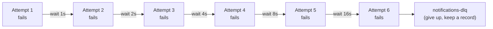

Knowing these solve two different problems — "the destination is unhealthy" vs. "the broker itself
is unreachable" — and picking the mechanism to match is the actual system-design skill, not just
"I added retries."

**Learn more**: [AWS's "Exponential Backoff and Jitter"](https://aws.amazon.com/blogs/architecture/exponential-backoff-and-jitter/)
is the canonical piece on this specific topic — it goes a step further than the fixed doubling
above and explains why adding *randomness* to the delay (jitter) reduces total retry load even
more than plain exponential backoff alone, from engineers who've operated retries at AWS's scale.

## Rate limiting — **we have something related, but not this**

**What it is, plainly**: capping how many requests a client can make in a given time window,
usually to protect the system from being overwhelmed (by a bug, a bot, or an abusive client) — a
client that exceeds the limit gets a `429 Too Many Requests` response instead of being served.

The classic implementation is a **token bucket**: each client has a bucket that holds N tokens and
refills at a steady rate; every request takes one token; an empty bucket means the next request is
rejected until the bucket refills a bit.

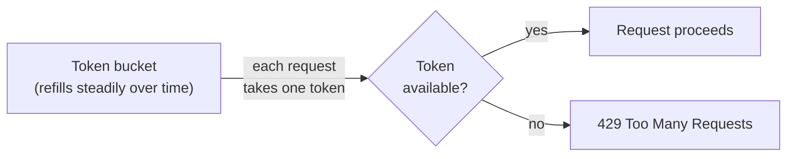

**What we actually built, and why it's a different thing**: `OrderVelocityTracker` and
`PaymentVelocityTracker` use Redis to count how fast a client is submitting orders/payments — but
this is **fraud-signal input**, not API protection. It feeds a rule ("this client just submitted 20
orders in 10 seconds, that's suspicious") rather than rejecting requests outright with a 429. The
API itself has no request-volume cap protecting it from being overwhelmed.

**Where a real one would go**: a Spring filter or gateway-level rate limiter (the token-bucket
diagram above), in front of the whole API, keyed by client ID or IP, backed by the Redis instance
that's already running — the infrastructure to do this properly is already in place, it just isn't
wired up as an API-protection mechanism yet.

**Learn more**: [Stripe's "Scaling your API with rate limiters"](https://stripe.com/blog/rate-limiters),
written by Stripe engineer Paul Tarjan, is the best real-world account of this — not a theoretical
description but four different limiters Stripe actually runs in production (request-rate,
concurrent-requests, and two load-shedding tiers), why one wasn't enough, and how they rolled each
one out safely without breaking existing customers.

## Idempotency

**What it is, plainly**: an operation is idempotent if doing it twice has the same effect as doing
it once. This matters constantly in distributed systems because a client can never fully know if a
request failed *before* or *after* the server actually processed it — a timeout could mean either.
If the client's only safe move is "retry," the server needs to make retrying safe.

**What we built**: `PaymentServiceImpl.submit` takes a client-supplied idempotency key and looks up
`findByIdempotencyKey` *before* doing anything else — a retried submission with the same key
returns the original payment instead of creating a second one.

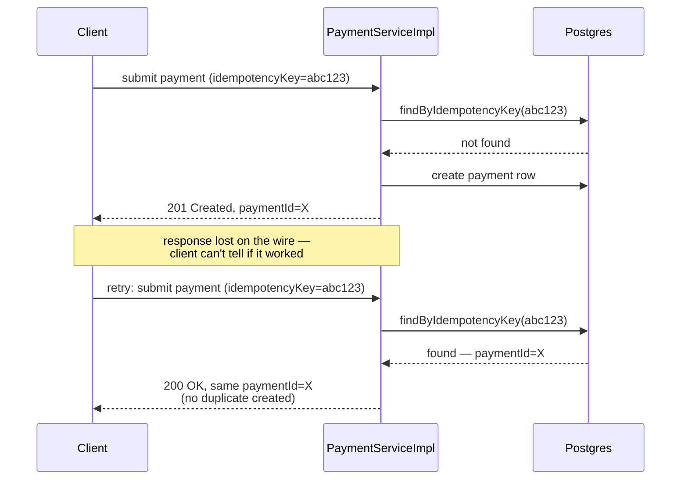

**Learn more**: [Stripe's engineering blog on idempotency keys](https://stripe.com/blog/idempotency)
is the widely-cited real-world explanation of exactly this pattern, from a company whose entire
business depends on getting it right.

## Caching

**What it is, plainly**: keep a fast, disposable copy of data that's expensive or slow to fetch
from its source of truth, so repeated reads don't hit the slow path every time. The trade-off is
always: how stale can this data be before it matters?

The specific shape we use is called **cache-aside**: the app checks the cache first, and only goes
to the real, slower source if the cache doesn't have it — then fills the cache for next time.

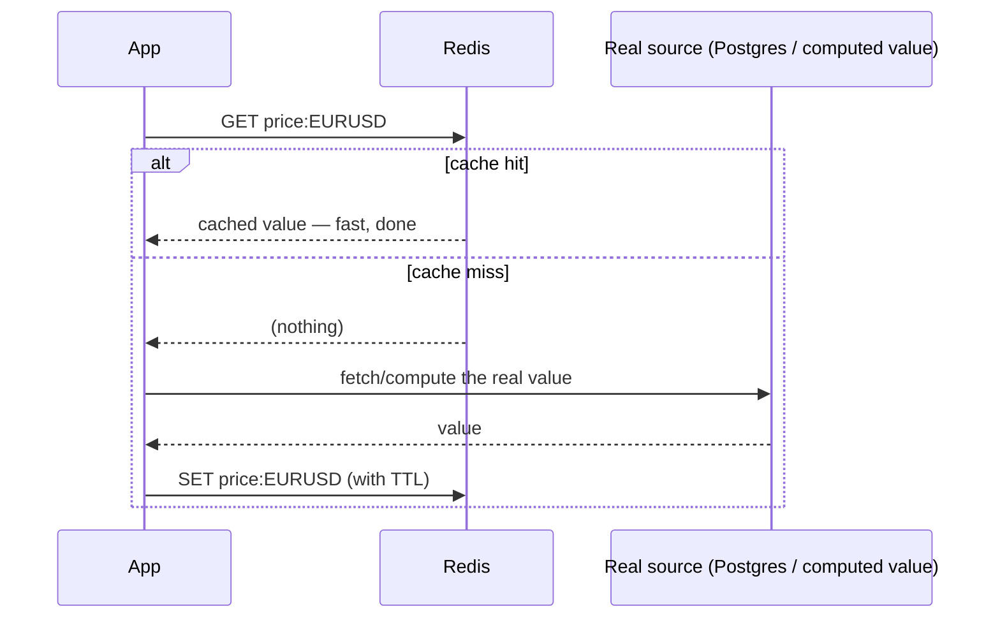

**What we built**: Redis caches the current simulated FX/stock rate per symbol with a TTL — one
shared source of truth for "what's the rate right now" that both the trading desk and account
currency conversion read, rather than each computing its own slightly-different number.

**Learn more**: [Microsoft's Cache-Aside pattern writeup](https://learn.microsoft.com/en-us/azure/architecture/patterns/cache-aside)
is the clearest single explanation of the pattern itself — not because it's Microsoft's, but
because it's written as a genuine pattern-language entry (context, problem, solution, trade-offs,
when *not* to use it — read the "staleness after writes" section especially) rather than a product
pitch. Cache-aside itself is client-side convention, not a Redis feature to configure — the pattern
would read identically if the cache underneath were Memcached instead.

---

# Part 2 — Containers, Explained From Zero

## What is an image? What is a container?

Think of an **image** as a recipe (or, more precisely, a read-only snapshot of a filesystem plus
metadata about what command to run) — "start from this base operating system, install Java, copy in
this JAR file, run it with this command." A **container** is a *running instance* of that recipe —
the same relationship a class has to an object, or a stored program has to a running process.
Because an image is a self-contained snapshot including the OS libraries the app needs, a container
started from it behaves identically on any machine that can run Docker, regardless of what's
actually installed on the host.

Images are built in layers (each instruction in a `Dockerfile` adds one layer), and layers are
cached and shared — that's why rebuilding an image after a small code change is usually fast, only
the changed layers get rebuilt.

**A multi-stage build** — which every backend image in this project uses — is a `Dockerfile` with
more than one `FROM` line: an early stage has the full build toolchain (a JDK, Maven) to compile
the code, and a later, much smaller stage copies *only the compiled output* into a minimal runtime
image. The build tools themselves never ship in the final image — smaller, faster to pull, and a
smaller attack surface.

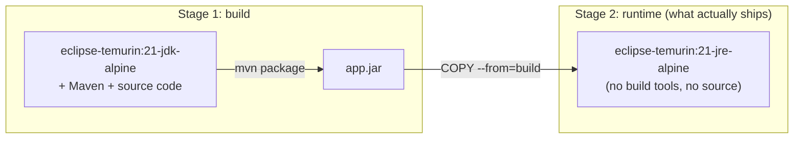

## Every container in this project, and what it's for

| Service | Image | What it actually is |
|---|---|---|
| `app` | Built from `eclipse-temurin:21-jdk-alpine` → `eclipse-temurin:21-jre-alpine` (multi-stage) | The main Spring Boot API (`bate-banking-core`) |
| `bate-mcp` | Same base images, own separate build | The real MCP server exposing the three Claude-backed AI tools |
| `frontend` | `node:22-alpine` (build) → `nginx:alpine` (serve) | The React app, compiled to static files and served by nginx |
| `postgres` | `postgres:18-alpine` | The database of record |
| `redis` | `redis:8-alpine` | Cache + fraud-velocity tracking |
| `kafka` | `apache/kafka:4.3.1` | The event broker |
| `jaeger` | `jaegertracing/all-in-one:latest` | Distributed tracing UI + collector, one all-in-one image |
| `prometheus` | `prom/prometheus:latest` | Metrics scraping + storage |
| `grafana` | `grafana/grafana:latest` | Dashboards on top of Prometheus's data |

Everything above `postgres` in the table is *our* code, built from a `Dockerfile` in this repo.
Everything from `postgres` down is a pre-built, off-the-shelf image pulled straight from Docker
Hub — we don't maintain those, we just run them with the right configuration.

## The container topology

`docker/docker-compose.yml` puts every one of these on one shared Docker network, so they can reach
each other by service name (`app` talks to `postgres:5432`, not `localhost:5432`) — that's what
lets the exact same `docker-compose.yml` work on any machine with Docker installed.

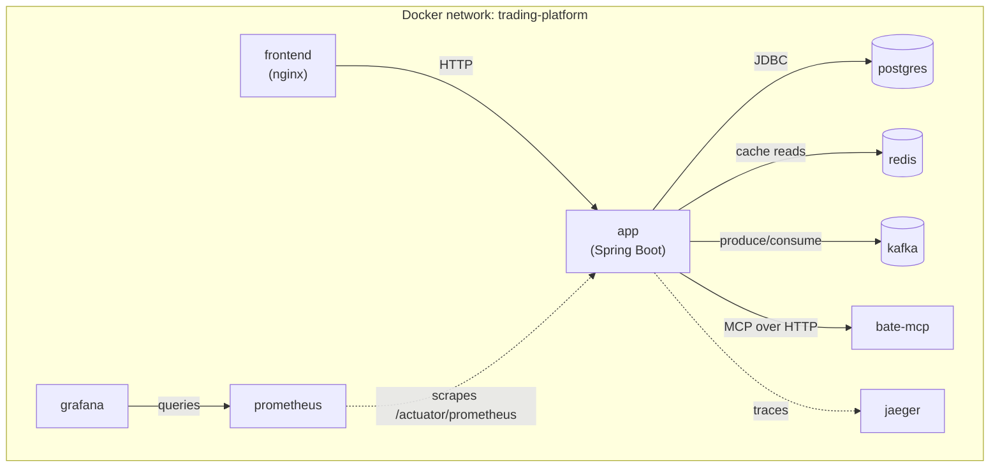

## Docker Compose vs. Kubernetes vs. Helm — why three tools for "run my containers"

This confuses almost everyone starting out, so it's worth being precise using the same
what-is-it/how-invoked/what's-the-outcome breakdown from the intro:

- **Docker Compose** — covered in full above as the worked example. One YAML file, one CLI command,
  containers running on **one machine only**. It has no concept of "if this machine dies, move the
  containers somewhere else," or "traffic doubled, start three more copies of `app`" — it's a
  single-host tool by design.

- **Kubernetes**. *What it is*: not one program — a **cluster** of machines (called *nodes*) running
  a set of coordinating programs (collectively "the control plane"), plus an API server that's the
  single front door for everything. *How we invoke it*: we write plain YAML manifests
  (`k8s/deployment.yaml`, `k8s/service.yaml`, …) describing *desired state* ("I want 2 running
  copies of this image"), then run `kubectl apply -f k8s/` — `kubectl` is a CLI that just POSTs
  that YAML to the API server. *What actually happens*: the API server saves that desired state to
  its own internal database (`etcd`), and a separate background process (a *controller*) notices
  the gap between desired state and reality and continuously acts to close it — starting pods on
  whichever node has room, restarting one that dies, moving pods off a node that goes offline. That
  continuous "notice a gap, fix it" loop, running forever in the background, is the entire idea of
  Kubernetes and the reason it can do things Compose fundamentally can't: nobody has to notice a
  crashed container and manually restart it, because the controller already is. Scaling replica
  count based on load is `k8s/hpa.yaml` (`HorizontalPodAutoscaler`) — the same idea, just the
  "desired state" itself moves automatically based on a metric like CPU%.

  ```mermaid
  graph LR
      You["You: kubectl apply -f k8s/"] -->|"POST desired state"| API["API server"]
      API -->|"writes"| Etcd[("etcd —<br/>desired state store")]
      Ctrl["Controller<br/>(runs forever)"] -->|"reads desired state"| Etcd
      Ctrl -->|"reads actual state"| Cluster["The actual cluster<br/>(what's really running)"]
      Ctrl -->|"gap found? → act:<br/>start / restart / move a pod"| Cluster
      Cluster -.->|"a pod crashes on its own"| Ctrl
  ```

  That bottom feedback arrow is the entire point: a pod crashing is just a new gap the controller
  notices on its *next* pass through the loop — nobody has to page anyone, and nothing has to
  "fail over" in the traditional sense, because the loop was always going to run again anyway.

- **Helm**. *What it is*: `helm` is a CLI tool; a *chart* (`helm/trading-platform/`) is a directory
  of YAML **templates** plus a `values.yaml` of variables to fill into them — not valid Kubernetes
  YAML on its own, more like a mail-merge template. *How we invoke it*: `helm install trading-platform
  helm/trading-platform -f values-prod.yaml`. *What actually happens*: Helm reads the templates,
  substitutes in the values from that specific file (so `values-dev.yaml` and `values-prod.yaml` can
  give the same template different replica counts or resource limits), renders the result into
  plain, ordinary Kubernetes YAML in memory, and then does exactly what `kubectl apply` does — sends
  it to the cluster's API server. Helm's whole job ends the moment that YAML is generated and sent;
  everything after that is just Kubernetes doing what it always does. The reason this exists at all:
  raw manifests are static text, so without templating, "slightly different settings per
  environment" means either hand-maintaining near-duplicate files or writing your own templating —
  Helm is the standard, shared answer to that problem.

**What we actually verified, and what we didn't**: `helm/trading-platform/` was genuinely installed
onto a real local Kubernetes cluster (`kind` — Kubernetes-in-Docker, a tool that runs an entire
small Kubernetes cluster *inside Docker containers* on one laptop, specifically for this kind of
local testing) — all pods reached `Running`, liveness/readiness probes reported healthy via
port-forward. It has **not** been verified against a real cloud Kubernetes service (GKE/EKS/AKS) —
worth saying directly if asked, rather than implying more than was actually tested.

**Learn more**: Julia Evans writes the best "a real engineer explains this clearly" content on
both of these, and it shows — [What even is a container?](https://jvns.ca/blog/2016/10/10/what-even-is-a-container/)
walks through the actual Linux kernel features (namespaces, cgroups) a container is built out of,
and [A few things I've learned about Kubernetes](https://jvns.ca/blog/2017/06/04/learning-about-kubernetes/)
explains the API-server/etcd/controller shape from someone who debugged it for real, not from a
marketing page. The official [Kubernetes concepts docs](https://kubernetes.io/docs/concepts/overview/)
and [Helm docs](https://helm.sh/docs/) are worth keeping open alongside those for exact terminology.

---

# Part 3 — Backend Platform

## Java 21

**What it gives us**: the language and runtime everything else sits on. LTS release, so it's
supported for years, not months — a real system-design consideration on its own (you don't want to
be forced to upgrade a production system's language version on a vendor's short timeline).

Three specific Java 21-era features actually used, worth naming precisely rather than lumping
everything under "Java 21 features":

- **Virtual threads** (finalized in Java 21 via [JEP 444](https://openjdk.org/jeps/444)) — cheap,
  JVM-managed threads that let you write ordinary blocking-style code (no reactive/callback
  gymnastics) while still handling huge numbers of concurrent I/O-bound operations, because a
  blocked virtual thread doesn't tie up a scarce OS thread the way a blocked platform thread does.

  ```mermaid
  graph TB
      subgraph "Before: one OS thread per request"
          R1["Request A"] --> PT1["OS thread — blocked,<br/>waiting on the database"]
          R2["Request B"] --> PT2["OS thread — blocked,<br/>waiting on the database"]
          R3["Request 5,001"] -.->|"thread pool exhausted<br/>→ request queues or is rejected"| Wait["..."]
      end
      subgraph "With virtual threads: many cheap threads, few real OS threads"
          V1["Virtual thread A"] --> Pool["Small pool of<br/>real OS threads"]
          V2["Virtual thread B — blocked"] -.->|"JVM unmounts it,<br/>frees the OS thread for someone else"| Pool
          V3["Virtual thread C"] --> Pool
      end
  ```

  `spring.threads.virtual.enabled=true` puts every Spring MVC request on one; a dedicated executor
  bean (`config/VirtualThreadConfig.java`) handles I/O-bound fan-out work off the request thread,
  e.g. broadcasting WebSocket updates to many subscribers.
- **Records** (finalized earlier, in Java 16 via [JEP 395](https://openjdk.org/jeps/395), but used
  heavily throughout this Java 21 codebase) — a compact, immutable data class where the compiler
  generates the constructor, `equals`, `hashCode`, and accessors from the field list alone. 74 of
  them here, almost every API response DTO.
- **Pattern matching for `switch`** (finalized in Java 21 via [JEP 441](https://openjdk.org/jeps/441))
  — arrow-form `switch` expressions for the small set of enum-driven branches (game status, order
  side) where it's more readable and compiler-checked (a missing case is a compile error, not a
  silent runtime bug) than an if/else chain.

**Learn more**: [InfoWorld's "Intro to virtual threads"](https://www.infoworld.com/article/2337208/intro-to-virtual-threads-a-new-approach-to-java-concurrency.html)
by Matthew Tyson is a clear, hands-on walkthrough with a real benchmark (50,000 tasks: ~5.4 seconds
on platform threads vs. ~174ms on virtual threads) rather than just a features list. If you want it
from someone who actually worked on the feature, [Nicolai Parlog's virtual-threads hub](https://nipafx.dev/virtual-threads/)
collects his talks and deep-dive videos on it.

## Spring Boot 4.1.0

**What it gives us**: the framework that wires everything else together — dependency injection,
auto-configuration (adding a dependency to `pom.xml` is usually enough to get a sensible default
setup, no XML), embedded web server, and a huge, well-trodden ecosystem of "starters" for exactly
the pieces used here (`spring-boot-starter-web`, `-security`, `-data-jpa`, and so on).

**Why this is good interview material specifically**: this was the newest major version at the time
of building, and upgrading to it surfaced two genuine framework-level bugs — much stronger material
than "I used Spring Boot," because it shows you can debug the framework itself, not just your own
code on top of it.

1. **Kafka topic auto-provisioning silently stopped working.** Boot 4 split `KafkaAdmin`
   autoconfiguration into a new `spring-boot-kafka` module; without depending on it directly
   (alongside `spring-kafka`), the app's `NewTopic` beans were never actually applied to the
   broker. No error — topics just didn't get created. Full writeup: [KAFKA_SETUP.md](KAFKA_SETUP.md).
2. **Distributed tracing produced zero spans, silently.** Boot 4 splits tracing autoconfiguration
   across two modules, and neither actually constructs the `Tracer` bean that makes spans get
   created — a no-op tracer silently won instead. Only caught by tracing a real request and
   noticing Jaeger's service list never grew. Fixed by hand
   (`config/TracingConfig.java`). Full writeup: [OBSERVABILITY_PROOF.md](OBSERVABILITY_PROOF.md).

Both bugs share a lesson worth stating out loud in an interview: *adding a starter dependency is
not proof a feature works* — both were only caught by actually generating real traffic and checking
the real output, not by reading the docs and trusting them.

**Learn more**: [Spring Boot's official reference docs](https://docs.spring.io/spring-boot/index.html).

## Spring Security + JWT (OAuth2 Resource Server)

**What a JWT is, mechanically — no server involved at all**: unlike almost everything else in this
doc, a JWT is not a running process, not a file, not a database row. It's just a string — three
base64-encoded chunks separated by dots (`header.payload.signature`) — created by our own
`JwtIssuer` class at login time and handed back to the client, who sends it back on every later
request in an `Authorization: Bearer ...` header. There's no lookup, no external identity service
involved in verifying it: `NimbusJwtDecoder` (a plain library, part of the request-handling code,
not a separate process) recomputes the signature locally using the same shared secret and checks it
matches — that's the entire "authentication" step, a few milliseconds of local math, not a network
call anywhere.

**What it gives us in plain English**: a way to know *who* is calling the API (authentication) and
whether they're *allowed* to do what they're asking (authorization) — without the server having to
remember every logged-in user in memory. That's what "stateless" means here: the JWT itself carries
proof of who you are, signed so it can't be forged, and the server just re-checks the signature on
every request instead of looking anything up.

```mermaid
sequenceDiagram
    participant C as Client
    participant Auth as AuthController / JwtIssuer
    participant API as Any protected endpoint

    C->>Auth: POST /auth/login (email, password)
    Auth->>Auth: check bcrypt hash, sign a JWT<br/>with the shared secret
    Auth-->>C: JWT string (header.payload.signature)
    Note over C: client just stores the string —<br/>the server keeps no session at all

    C->>API: GET /v1/accounts/123<br/>Authorization: Bearer &lt;JWT&gt;
    API->>API: recompute the signature locally,<br/>compare — no network call, no lookup
    API->>API: CallerPrincipal + requireOwner() check
    API-->>C: 200 OK (or 403 if not the account's owner)
```

**Two layers, and the distinction between them is the actual interview point**:
`@PreAuthorize("hasRole('CLIENT')")` proves the caller is *some* authenticated client — not that
they own the specific account they're trying to read. That's a genuinely common real-world bug
class (an API that correctly rejects anonymous users but lets any logged-in user read anyone else's
data). We close that second gap with `security/CallerPrincipal` (read from the JWT's validated
subject claim) plus a `requireOwner()` check on every account/payment/transfer/loan method —
verified for real with `AccountSecurityIntegrationTest`, hand-signing two real JWTs and confirming
client A gets a genuine 403 reading client B's account against the actual filter chain.

**Two real bugs found in this flow**, both documented in
[INTERVIEW_TALKING_POINTS.md](INTERVIEW_TALKING_POINTS.md#what-security-issue-did-you-find-and-fix-in-your-own-code):
a committed placeholder `jwt.secret` that could silently become the *real* production secret if an
environment variable was left unset, and a logout that only cleared client-side cookies while the
server-side refresh token stayed valid for up to 7 days.

**Learn more**: [Spring Security's official reference docs](https://spring.io/projects/spring-security),
and [jwt.io](https://jwt.io/introduction) for how a JWT itself is actually structured and verified.

## Spring Data JPA

**What it gives us in plain English**: a way to work with database rows as ordinary Java objects
instead of hand-writing SQL for every query — define a repository *interface* (no implementation
class at all), and Spring generates the implementation for you at startup, including turning a
method name like `findByIdempotencyKey` directly into the right `WHERE` clause.

**What it is, mechanically — there is no real class behind the interface, at least not one you
wrote**: `PaymentRepository extends JpaRepository<Payment, UUID>` is just an interface. At startup,
Spring Data JPA scans for interfaces like this and generates a real implementing class at runtime
using a **dynamic proxy** — a class built in memory, not something sitting in your source tree —
that translates each method call into a query. `findByIdempotencyKey(String key)` is parsed
*by its name alone*: `findBy` + `IdempotencyKey` becomes
`SELECT * FROM payments WHERE idempotency_key = ?`, entirely from the method signature, no query
string written anywhere.

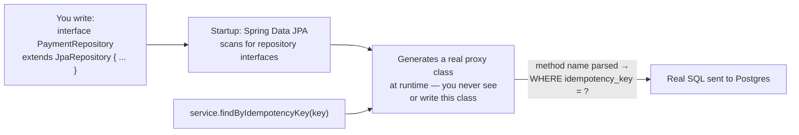

**What we built**: every entity (`Account`, `Payment`, `Loan`, `GameSession`, …) has a repository
extending `JpaRepository`, with a handful of hand-written `@Query` methods where a derived name
would be unreadable, or where you specifically want the database to do the work instead of loading
every row into memory — `GameTradeRepository.sumRealizedPnl` sums realized profit/loss directly in
SQL rather than pulling every trade into Java to add them up by hand.

**Learn more**: [Spring Data JPA's official docs](https://spring.io/projects/spring-data-jpa).

## WebSockets

**What it gives us in plain English**: HTTP is request-then-response — the server can't push data
to a client unprompted. A WebSocket is a long-lived, two-way connection that lets the server push
updates the moment they happen, instead of the client having to keep asking "anything new yet?"

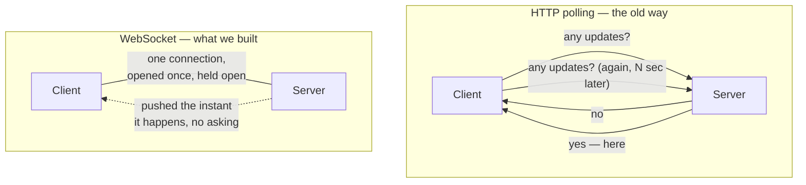

**What we built**: `config/WebSocketConfig.java` + `trading/websocket/OrderStreamHandler.java` — a
raw Spring WebSocket endpoint (not the heavier STOMP messaging protocol, since we don't need topic
subscriptions or a message broker, just a direct push) broadcasting live order-book updates,
dispatched onto virtual threads so one slow client's socket write can't stall the broadcast to
everyone else.

**Learn more**: [Spring Framework's WebSocket reference chapter](https://docs.spring.io/spring-framework/reference/web/websocket.html)
covers the raw API this project uses directly, plus the heavier STOMP/message-broker layer on top
of it that this project deliberately doesn't need.

## Spring MVC cross-cutting concerns

A handful of mechanisms used consistently everywhere rather than reinvented per-controller — the
kind of thing that separates "I know Spring" from "I know how to keep a large Spring codebase
maintainable":

- **Centralized exception handling** (`@RestControllerAdvice`) — `exception/GlobalExceptionHandler`
  is the one place every domain exception gets mapped to an HTTP status, grouped by status. Adding a
  new domain exception is a one-line addition to the right group, not a new try/catch somewhere.

  ```mermaid
  graph LR
      Ctrl["Any controller/service throws,<br/>e.g. AccountNotFoundException"] --> GEH["GlobalExceptionHandler<br/>(@RestControllerAdvice — catches<br/>it no matter which controller)"]
      GEH -->|"NotFound group"| R404["404"]
      GEH -->|"Conflict group"| R409["409"]
      GEH -->|"BadRequest group"| R400["400"]
      R404 --> Body["one consistent ApiError JSON body"]
      R409 --> Body
      R400 --> Body
  ```
- **Bean Validation** (Jakarta `jakarta.validation`, via `spring-boot-starter-validation`) —
  `@NotNull`/`@NotBlank`/`@Positive`/`@Size`/`@Email` on request DTOs, enforced automatically with
  `@Valid` at the controller boundary, so invalid input never reaches business logic.

  ```mermaid
  graph LR
      Req["Incoming request body"] --> Deser["Deserialized into<br/>the request DTO"]
      Deser --> Valid{"@Valid checks every<br/>annotated field"}
      Valid -->|"all constraints pass"| Ctrl["Controller method body runs"]
      Valid -->|"any constraint fails"| MANV["MethodArgumentNotValidException"]
      MANV --> GEH2["GlobalExceptionHandler<br/>→ 400, field-level error list"]
  ```
- **`@Scheduled` background jobs** — 7 of them, the mechanism behind every periodic process:
  loan-interest accrual, the FX price feed's random walk, Kafka health checks, and more.
- **`@Transactional`** (19 usages) — drawing exactly the line the Saga section above explains: one
  method, one transaction, when everything's in the same database; a saga instead when it isn't.
- **Idempotency keys** — covered in Part 1 above.
- **Lombok** — `@RequiredArgsConstructor` (48 uses — constructor injection everywhere, never field
  injection), `@Slf4j` (46), `@Getter`/`@Setter`/`@Builder` on JPA entities. Deliberately *not*
  used on the response/DTO layer, where records are preferred (see Java 21 above) — Lombok for
  mutable entities that need a no-args constructor and setters, records for immutable API responses
  that don't.
- **Spring Boot Actuator** — `/actuator/health`, `/info`, `/prometheus`, `/metrics` exposed, feeding
  both the Prometheus scrape and Kubernetes liveness/readiness probes. Includes one custom
  `HealthIndicator` (`actuator/MatchingEngineHealthIndicator`) surfacing live order-book depth
  through `/actuator/health` — extending Actuator with domain-specific health data, not just
  framework defaults.

**Learn more**: [Spring Boot's own Actuator reference chapter](https://docs.spring.io/spring-boot/reference/actuator/index.html)
and [Jakarta Bean Validation's official spec site](https://beanvalidation.org/).

---

# Part 4 — Low-Latency Engineering Patterns

This section is specific to the FX/stock matching engine, and it's worth knowing because it's a
genuinely *named* system in the code, not one isolated trick — five explicitly numbered "Low-Latency
Pattern" techniques cross-referenced in the javadoc of five different files.

**What "low latency" means as a goal**: for a matching engine specifically, every microsecond a
request spends waiting — for a garbage collector, for a lock held by unrelated work, for a
framework's overhead between "message arrived" and "business logic runs" — is microseconds a real
trading system can't afford, because price/time priority only means something if orders are
processed in the order they actually arrived.

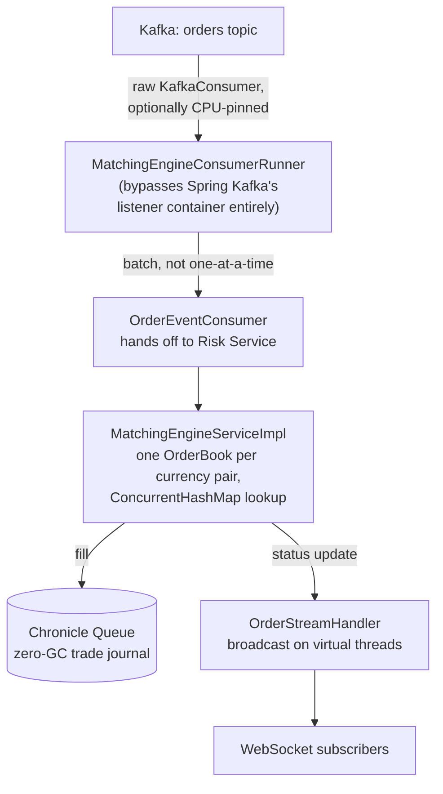

1. **Virtual threads** — I/O-bound fan-out work runs on virtual threads instead of a bounded
   platform-thread pool (Part 3 above).
2. **Fine-grained locking in the matching core** — one `OrderBook` per currency pair, looked up
   through a `ConcurrentHashMap` so unrelated pairs never contend with each other; matching within
   *one* book is synchronized to keep price/time priority correct. Coarse-grained locking (one lock
   for everything) would be simpler to write but would let a busy `GBP/USD` book stall an unrelated
   `EUR/JPY` match — a real, deliberate trade-off, not an accident.
3. **Batch consumption off the hot path** — orders are consumed in batches, not one Kafka poll per
   order.
4. **Bypassing the framework entirely, with optional CPU pinning** — `MatchingEngineConsumerRunner`
   uses the raw Apache Kafka client directly instead of a `@KafkaListener` container, so there's no
   Spring Kafka overhead between `poll()` and the matching logic, and optionally locks the polling
   thread to a physical CPU core (`net.openhft.affinity`'s `AffinityLock`) — the same technique real
   trading infrastructure uses to keep a thread's CPU cache warm and avoid the OS scheduler bouncing
   it between cores mid-loop.
5. **Non-blocking broadcast** — order-status updates go out on a virtual thread per WebSocket send,
   so one slow client connection can never back up the broadcast to everyone else.

**Honest framing if asked how rigorously this was benchmarked**: these are real techniques
correctly applied (zero-GC journaling, lock granularity, CPU pinning, framework bypass), not a
claim backed by nanosecond-level micro-benchmarks. [PERFORMANCE_BASELINE.md](PERFORMANCE_BASELINE.md)'s
numbers are Gatling end-to-end latencies (p99 67ms on transfers) — evidence the system performs well
as a whole, not proof any one pattern here was independently profiled in isolation.

**Learn more**: [OpenHFT's Chronicle Queue docs](https://github.com/OpenHFT/Chronicle-Queue) and
[OpenJDK's virtual threads JEP](https://openjdk.org/jeps/444) linked above.

---

# Part 5 — Data Layer

## PostgreSQL 18

**What it is, mechanically**: a genuinely separate running server process (its own container,
`postgres:18-alpine`) that our app connects to over the network using the standard Postgres wire
protocol, via a JDBC driver. It is not a file our app owns, and it's not embedded in our JAR — kill
the `app` container and Postgres itself is completely unaffected, still holding every row, exactly
as it should be for the one component everything else in the system is disposable relative to.

**What it gives us in plain English**: the permanent, single source of truth. Every account,
payment, loan, trade, and Game Mode session is a row here — if the whole app restarts, nothing is
lost, which is the entire point of a real database over holding state in memory.

Migrated from Postgres 16 → 18 mid-project, which required fixing a real Postgres 18 volume-layout
change in `docker-compose.yml` — a small, concrete "upgrading infrastructure breaks something
specific" story if asked about version upgrades.

**Learn more**: [PostgreSQL's official documentation](https://www.postgresql.org/docs/current/).

## Flyway

**What it is, mechanically — the opposite shape from Postgres itself**: Flyway is *not* a separate
server. It's a plain Java library, a dependency sitting inside our own app's JAR, running in the
same process as the rest of the app. There's nothing to "start" separately. *How it's invoked*: on
every Spring Boot startup, an auto-configured Flyway bean automatically runs, before the app starts
serving traffic. It opens its own JDBC connection to Postgres (the same database, over the network,
same as above), reads the `.sql` files bundled on the classpath at
`src/main/resources/db/migration/`, checks a table it maintains itself
(`flyway_schema_history`) to see which ones have already run, and executes any new ones in
numeric order. *The concrete outcome*: new tables/columns/constraints actually created in Postgres,
plus one new row per migration in `flyway_schema_history` recording exactly what ran and when — you
can `SELECT * FROM flyway_schema_history` right now and see the real history.

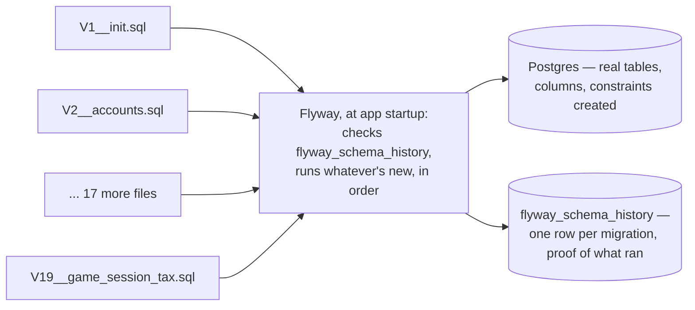

Every change to the database's shape (a new table, a new column) is one small, numbered `.sql`
file, checked into version control right alongside the code that needs it —
`src/main/resources/db/migration/` runs `V1` through `V19` at last count. Every migration follows
the same conventions: `NUMERIC(20,8)` for money, `TIMESTAMPTZ` for every timestamp, `CHECK`
constraints for real invariants (non-negative balances), and `DEFAULT` values chosen so an existing
in-progress row is never retroactively penalized by a new column.

**Why `NUMERIC` and never `double`/`float` for money — a genuinely important system-design point on
its own**: binary floating point can't represent most decimal fractions exactly (`0.1 + 0.2` does
not equal `0.3` in IEEE-754), which is an unacceptable rounding risk for real balances. Every money
field here is `BigDecimal` in Java and `NUMERIC` in Postgres, end to end, with no floating-point
math touching money anywhere.

**Learn more**: [Flyway's official documentation](https://documentation.red-gate.com/fd).

## Redis 8

**What it is, mechanically**: like Postgres and Kafka, a genuinely separate running server (own
container, `redis:8-alpine`) — our app is a client talking to it over the network, via the
`spring-data-redis` library. Concretely, "caching a price" means one line of Java —
`redisTemplate.opsForValue().set(key, price, ttl)` — which sends a real `SET` command with an
expiry over the wire to that separate process; a later read sends a `GET` command back the other
way. Everything Redis holds lives in that server's own memory, not ours.

**What it gives us in plain English**: fast, disposable storage for things that don't need to
survive forever and need to be read quickly — explicitly *not* the record of truth (that's always
Postgres).

Two real consumers: `PriceFeedServiceImpl` caches the current simulated rate per symbol; the
velocity trackers (Part 1 above) use it to track recent activity per client for fraud scoring.
Explicitly **not** used for JWT refresh tokens — those live in a real Postgres table with a
`revoked` flag, because token rotation needs durable, transactional guarantees a cache doesn't
promise. Also stated honestly as single-instance-correct only — a real multi-instance deployment
would need the velocity trackers backed by something shared and consistent, which Redis already is,
the current wiring just wasn't built with that scenario in mind.

**Learn more**: [Redis's official documentation](https://redis.io/docs/latest/get-started/).

## Chronicle Queue

**What it is, mechanically — the opposite of both Postgres and Redis above**: Chronicle Queue is
*not* a server, and there is no network involved at all. It's a plain Java library, and what it
actually does under the hood is memory-map a plain file that lives on the same machine's local
disk — writing a record is a direct memory write that the operating system flushes to that file,
with no socket, no serialization-for-the-wire, and (the whole point) no interaction with the JVM's
garbage collector, since the memory it writes to is outside the normal Java heap entirely
("off-heap"). That matters specifically on a hot execution path like a matching engine, where a GC
pause is a real, unpredictable source of latency you can't tolerate.

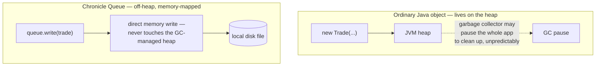

Every FX/stock trade fill is written here, completely separately from both the Postgres `trades`
row and the `trades` Kafka topic — three independent records of the same fact is deliberate for an
audit trail, so no single component's failure erases the record. Reused a second time as the
backing store for `KafkaEventPublisher`'s fallback queue (Part 1, Retries section) — proof it's a
technique applied wherever "durable, ordered, append-only, and fast" is genuinely the requirement,
not a one-off.

**Learn more**: [OpenHFT's Chronicle Queue GitHub](https://github.com/OpenHFT/Chronicle-Queue).

---

# Part 6 — Messaging: Apache Kafka 4.3.1

**What it is, mechanically**: Kafka is a genuinely separate running server (its own container here,
`apache/kafka:4.3.1`) called a **broker**. Our app is never Kafka itself — it's a *client*, using
the `spring-kafka` library, which opens a plain TCP connection to the broker and speaks Kafka's own
binary wire protocol. Nothing here is a file on disk from our app's point of view, and nothing is a
direct call into another part of our own code — it's bytes sent over a socket to a different
process, exactly like Redis or Postgres, just with a different protocol and a very different
delivery model underneath.

**The vocabulary, precisely, since these words get used loosely**:

- A **topic** is a named, append-only log — `orders`, `payments`, `notifications`, and 11 others
  here. "Append-only" means messages are never edited or deleted individually, only ever added to
  the end (and eventually expired wholesale after a retention period).
- A topic is physically split into **partitions** — `orders` has 10 here
  (`new NewTopic(topics.orders(), 10, (short) 1)` in `KafkaConfig.java`). Each partition is its own
  independent, strictly-ordered log with its own sequence number per message, called an **offset**.
  Ordering is only guaranteed *within* one partition, never across the whole topic — a real,
  deliberate trade-off: more partitions means more parallelism, at the cost of only having a total
  order within each slice.
- A **producer** is any client that writes messages onto a topic — `KafkaEventPublisher` here. Each
  message has a **key** (e.g. the account ID), and Kafka hashes that key to consistently pick which
  partition it lands on — so every event for the same account always lands on the same partition,
  in order, even though different accounts spread across all 10.
- A **consumer group** is a named set of consumer instances that share the work of reading a topic
  — `risk-service` is one real example here (`OrderEventConsumer`, `groupId = "risk-service"`).
  Kafka divides a topic's partitions among that group's active members, so **within one group**,
  each partition is read by exactly one member at a time (this is the queue-like, load-balancing
  half of Kafka). A **different** group reading the *same* topic gets its own full, independent copy
  of every message from offset zero (this is the pub/sub half) — that's how `orders` can feed
  `risk-service` while an entirely separate pipeline elsewhere reads a different topic without the
  two ever contending for the same messages.

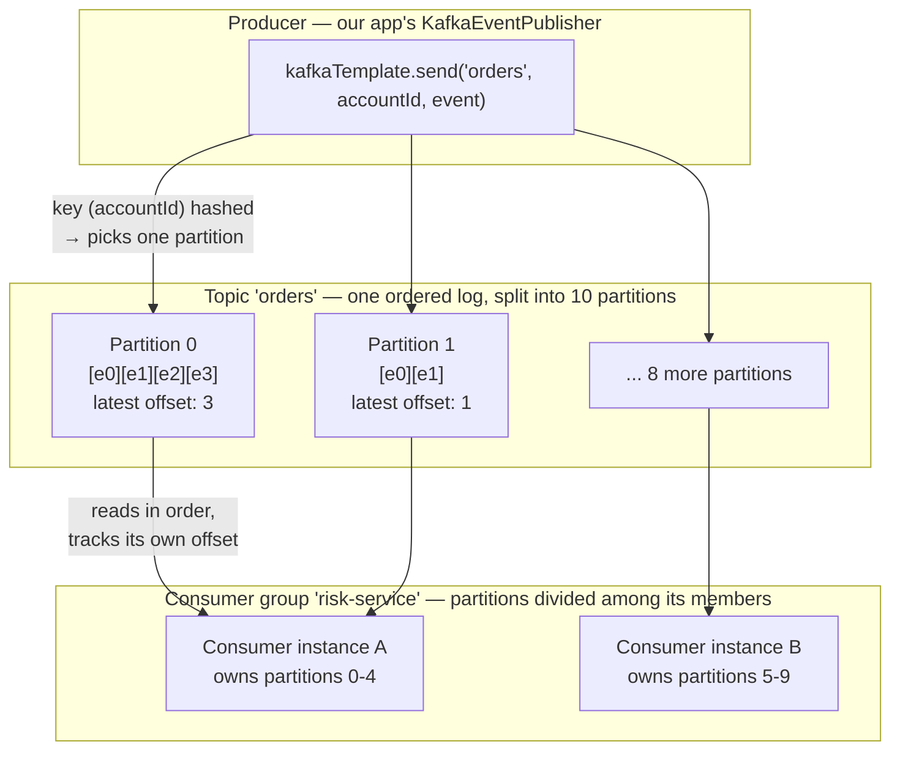

Real, grounded consumer groups from this codebase, each independently reading its own topic(s):
`risk-service` (`orders`), `matching-engine` (`orders-validated`, via a raw consumer bypassing
Spring Kafka entirely — Part 4), `execution-service` (`trades`), `fraud-detection-service`
(`payments`), `settlement-service` (`payments-validated`), `notification-service`
(`notifications`).

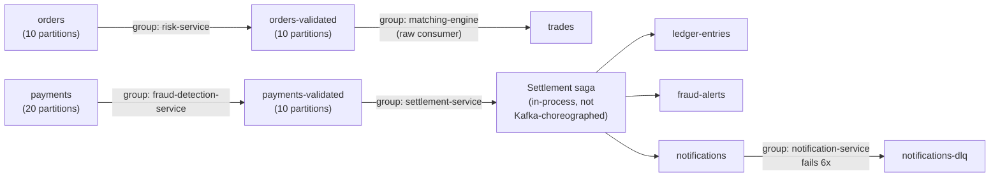

Two independent event chains: `orders → orders-validated → trades` for the FX/stock desk, and
`payments → payments-validated` for cross-bank settlement (the settlement saga itself, covered in
Part 1, runs in-process rather than being choreographed purely through Kafka hops — deliberately, to
keep the compensation logic in one reviewable place). Full topic/producer/consumer table in
[KAFKA_SETUP.md](KAFKA_SETUP.md).

**How this is actually invoked in code, concretely**: a producer call is one line —
`kafkaEventPublisher.publish(topicName, key, eventObject)` — which serializes the event to JSON and
hands it to `KafkaTemplate.send(...)`, an async call that returns immediately (the actual network
write happens on a background I/O thread). A consumer is a plain method annotated
`@KafkaListener(topics = "...", groupId = "...")` — Spring Kafka runs a background poll loop for
you and calls that method once per message it reads; you never write the poll loop yourself unless
you deliberately opt out of it, which the matching engine does on purpose (Part 4).

**Why Kafka over direct service-to-service REST calls**: decoupling (Part 1's Event-Driven
Architecture section) — a slow or down consumer never blocks the producer's HTTP response, it just
waits in the topic.

**Four real production bugs found and fixed here** (full root-cause writeups in
[KAFKA_SETUP.md](KAFKA_SETUP.md) — genuinely good "tell me about a bug you found" material):

1. Spring Boot 4's `KafkaAdmin` module split silently broke topic auto-provisioning (Part 3 above).
2. `KafkaConfig.producerFactory()`'s hardcoded properties bypassed `application.yml`, meaning
   `KafkaProducer.send()` could block a request thread up to 60 seconds waiting on topic metadata —
   caught by a suspiciously long Jaeger span, fixed by capping `max.block.ms` at 3 seconds.
3. Two independent eager Kafka calls at app startup meant a Kafka outage crashed the *whole app's
   boot*, not just degraded a feature — fixed with a lazy-connect pattern, verified by killing
   Kafka, confirming the app still boots healthy, then confirming every consumer group re-joins
   once Kafka's back with no app restart needed.
4. The fallback queue's own catch clause only caught one of two similarly-named Kafka exception
   types, so the exact failure it exists to catch could escape uncaught as a 500 — found by
   deliberately taking Kafka down and hitting the API, not by reading the code.

Non-blocking retry + dead-letter queue (`notifications-dlq`) and the Chronicle-backed fallback
queue are both covered in Part 1's Retries section above.

**Learn more**: [Jay Kreps' "The Log"](https://engineering.linkedin.com/distributed-systems/log-what-every-software-engineer-should-know-about-real-time-datas-unifying),
linked in Part 1's Event-Driven Architecture section above, is still the best conceptual read —
this section is the "and here's exactly how that plays out in one real codebase" companion to it.
For exact configuration and API details: [Apache Kafka's official documentation](https://kafka.apache.org/documentation/).

---

# Part 7 — AI / MCP

## Model Context Protocol (MCP) — real, not a REST facade

**What it gives us in plain English**: MCP is a standard protocol (like HTTP or SQL are standards)
specifically for letting an AI model's client — Claude Desktop, Claude Code, or in this case our own
backend — call external "tools" in a structured, discoverable way, rather than every integration
being a bespoke, undocumented REST call that only that one client understands.

**What actually makes this real MCP, not a REST endpoint wearing an MCP label**: a JSON-RPC 2.0
message envelope; an `initialize` handshake negotiating protocol version and capabilities;
`tools/list` for runtime tool discovery with an auto-generated JSON Schema per tool; `tools/call`
with a specific result shape; and session management via headers plus Server-Sent-Events framing.
Get any of that wrong and a real MCP client simply can't talk to your server, no matter how
sensible your JSON looks.

**What it is, mechanically**: `bate-mcp-server` is a genuinely separate running process — its own
container, its own port (`8081`), its own Spring Boot application entirely, built on
`spring-ai-starter-mcp-server-webmvc`. "Streamable HTTP" sounds abstract but is concretely just
ordinary HTTP requests: our `app` container makes a real HTTP POST to `http://bate-mcp:8081/mcp`
(reachable by that hostname purely because Docker Compose put both containers on one network — Part
2), carrying a JSON-RPC message as the body, over the same network Kafka and Postgres traffic also
travels; the response is either a normal HTTP response or, for the streaming case, held open as
Server-Sent-Events. `spring-ai-starter-mcp-server-webmvc` implements the full protocol
automatically from `@McpTool`-annotated methods — verified against the live running server with raw
`curl`, not assumed from documentation (full JSON-RPC exchange in `bate-mcp-server/README.md`).

`bate-banking-core` talks to it as a real MCP client (`io.modelcontextprotocol.sdk:mcp-core`'s
`McpClient.sync(...)`), which is itself just a library wrapping exactly that HTTP call — connecting
lazily on first use and never throwing — an unreachable server, a dropped connection, or a real MCP
error result all collapse to `Optional.empty()`.

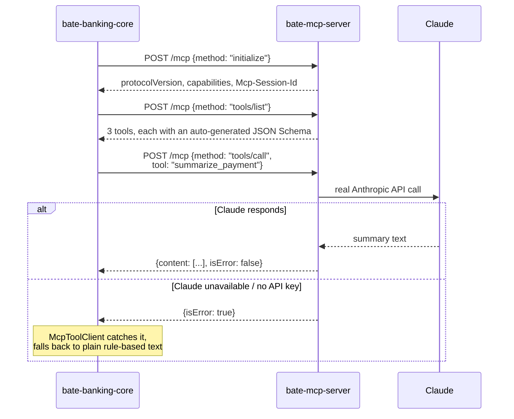

**Learn more**: [Humanloop's "Model Context Protocol (MCP) Explained"](https://humanloop.com/blog/mcp)
is a clear, person-written walkthrough of *why* MCP exists — it frames the actual problem it
solves (every AI app needing its own bespoke connector to every tool, the "M×N integration
problem") before getting into the mechanics. The [official spec](https://modelcontextprotocol.io/)
is where the exact protocol details in this section came from, and is worth it once the "why"
already makes sense.

## Claude (Anthropic) — advisory, never the decision-maker

Three call sites — fraud anomaly explanations, payment settlement summaries, Game Mode debriefs —
and the pattern is identical and deliberate at all three: ordinary rule-based code makes the actual
decision *first*, and Claude is only ever asked afterward to add human-readable commentary on a
decision that's already final.

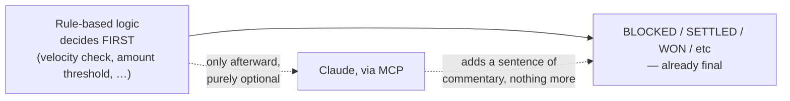

If Claude (or the MCP hop) is unavailable, the underlying decision doesn't change — a plain,
rule-computed fallback ships instead. Strong answer to "what happens if your AI dependency goes
down": nothing, because it was never on the critical path for anything that moves money.

**Learn more**: [Claude's API documentation](https://platform.claude.com/docs/) (Anthropic's docs
moved here — the old `docs.anthropic.com` now redirects to this).

---

# Part 8 — Observability

All three are separate running server processes (own containers) — none of this lives inside our
app's own process, which matters because it means the app keeps running even if the whole
observability stack is down; it just stops being *watchable* for that period.

**What each one is, mechanically, and how it actually gets data — the direction of the arrow is
different for each one, which is the part that's easy to get backwards**:

```mermaid
graph LR
    Prom["Prometheus"] -->|"PULLS — GET /actuator/prometheus<br/>every 15s, on its own timer"| App["app"]
    App -->|"PUSHES — spans sent over<br/>the OTLP protocol"| Jaeger["jaeger"]
    Graf["Grafana"] -->|"QUERIES on demand,<br/>only when you open a dashboard"| Prom
```

- **Prometheus** *pulls*. It is Prometheus itself that makes an outbound HTTP GET request to our
  app's `/actuator/prometheus` endpoint, on a timer (every 15 seconds by default), and stores
  whatever plain-text metric values it gets back into its own on-disk time-series database. Our app
  never pushes anything to Prometheus — it just exposes one endpoint and waits to be scraped. 151
  distinct metric names here, including custom business metrics like `transfer_latency_seconds` and
  `fraud_detection_latency_seconds`, not just JVM defaults.
- **Grafana** *queries on demand*. It has no data of its own — every time you open a dashboard panel
  in a browser, Grafana's backend sends a query (in Prometheus's own query language, PromQL) to
  Prometheus's HTTP API and renders whatever comes back. A dashboard itself is just a JSON file
  (`docker/grafana/dashboards/banking-platform.json`, 5 panels) describing which queries to run and
  how to chart the results.
- **Jaeger** is *pushed to*. Our app's OpenTelemetry SDK batches up spans in memory and periodically
  sends them over the network (the OTLP protocol, to `jaeger:4318`) — the opposite direction from
  Prometheus. Jaeger answers a much more specific question than the other two: "for *this one* slow
  request, which exact step took the time?" — a span waterfall showing security filter chain,
  method authorization, business logic, and database write as separate, timed segments of one
  request.

All three were verified against real API traffic, not just configured and assumed working — real
trace IDs, real metric values, real dashboard screenshots, captured in
[OBSERVABILITY_PROOF.md](OBSERVABILITY_PROOF.md). Jaeger specifically required the Spring Boot 4.1.0
`Tracer`-bean fix from Part 3 above.

**Learn more**: [Charity Majors' "Observability is a Many-Splendored Definition"](https://charity.wtf/2020/03/03/observability-is-a-many-splendored-thing/)
is worth reading before any of the tool docs — she literally helped coin modern usage of the term
at Honeycomb, and her actual point is sharper than "three pillars": observability is being able to
ask a question you *never anticipated*, without shipping new code to answer it, which is a real
standard to hold a setup like this one to rather than just "we have dashboards." Once that clicks,
the [Prometheus](https://prometheus.io/docs/), [Grafana](https://grafana.com/docs/),
[Jaeger](https://www.jaegertracing.io/docs/), and [OpenTelemetry](https://opentelemetry.io/docs/)
docs are where to go for the specific tool APIs.

---

# Part 9 — Testing

These four tools sit at different heights of the classic **testing pyramid** — a term
[Martin Fowler coined in 2012](https://martinfowler.com/bliki/TestPyramid.html): many fast, cheap
tests and few slow, expensive ones, because a test suite made of nothing but slow ones is one
nobody runs often enough to be useful. If you want the long-form, code-level version of this same
idea, [Ham Vocke's "The Practical Test Pyramid"](https://martinfowler.com/articles/practical-test-pyramid.html)
(also on Fowler's site) walks through actually writing each layer in a Java/Spring Boot service —
about as close to this project's own shape as you'll find:

```mermaid
graph TB
    Unit["Unit tests — JUnit Jupiter + Mockito<br/>42 classes. Milliseconds each.<br/>Run on every save."]
    Integ["Integration tests — Testcontainers<br/>Real Postgres/Kafka. Seconds each.<br/>Run before every commit."]
    Load["Load tests — Gatling<br/>Real HTTP traffic, a running app.<br/>Minutes. Run deliberately, not constantly."]
    Unit --> Integ --> Load
```

**What each layer is, mechanically, and how it's actually invoked**:

- **JUnit Jupiter + Mockito** — worth naming precisely: this project runs on `junit-jupiter` **6.0.3**
  (confirmed via `mvn dependency:tree`) — the same `@Test`/`@BeforeEach` programming model everyone
  still calls "JUnit 5," now shipped under the umbrella "JUnit 6" release. Both libraries are plain
  Java, no separate process. `mvn test` compiles and runs every method annotated `@Test`; Mockito's
  mocks are just fake objects created in memory for the duration of one test method. The standard
  unit-testing shape: mock out a service's collaborators (repositories, external clients) and test
  its logic in isolation. 42 test classes here.
- **Spring Security Test** — also just a library, adding one utility that hand-signs a *real* JWT
  string and sends it through the *real* filter chain inside the test, instead of mocking "assume
  this user is logged in" — the difference between testing that a security check exists and testing
  that it actually works end to end.
- **Testcontainers** — the one genuinely different mechanism here: it's a library, but the thing it
  *does* when a test runs is talk to the Docker Engine API (the same API `docker compose` talks to
  — Part 2) to programmatically start a real, throwaway Postgres/Kafka container just for that test
  run, then tear it down when the test finishes. No manual `docker run` — the test class itself
  triggers real containers starting and stopping. The point: a query that only works against a
  lighter stand-in (H2, embedded Kafka) is a false positive; Testcontainers tests against the exact
  images production actually runs.
- **Gatling** — a separate Maven plugin plus Scala-based "Simulation" classes we write
  (`TransferLoadSimulation`, etc.). *How it's invoked*: `mvn gatling:test
  -Dgatling.simulationClass=...`. *What actually happens*: Gatling compiles that simulation, then
  fires real concurrent HTTP requests at the actually-running app over the network — this is not a
  mock or a calculation, it's genuine load hitting genuine running code — records every response
  time, and writes an HTML report file to `target/gatling/.../index.html` you can open in a browser.
  0% failure rate across 750 real requests, transfer p99 latency 67ms against a 500ms target — full
  results in [PERFORMANCE_BASELINE.md](PERFORMANCE_BASELINE.md), stated honestly as evidence of "no
  obvious bottleneck at small scale," not a claim about scaling to the full originally-planned
  sizing.
- **JaCoCo** — a Maven plugin with two parts: a Java *agent* that attaches to the JVM the instant
  `mvn test` starts and instruments the bytecode to record which lines actually executed, and a
  second goal that reads what the agent recorded and generates an HTML coverage report afterward.
  Wired into the Maven build itself, so it happens automatically on every test run, not a separate
  manual step.

```mermaid
graph LR
    subgraph "Mockito — a fake object in memory"
        T1["Test method"] -->|"mock(Repository.class)"| M["Fake repository —<br/>no database at all"]
    end
    subgraph "Testcontainers — a real, throwaway container"
        T2["Test method"] -->|"talks to Docker Engine API"| C["Real postgres:18-alpine<br/>container, started just<br/>for this test run"]
        C -->|"torn down after"| Gone["gone"]
    end
```

**Learn more**: the test pyramid links above are the ones worth actually reading; for exact tool
APIs there's [JUnit's user guide](https://docs.junit.org/current/user-guide/) (the JUnit 5 docs URL
now redirects here, under the JUnit 6 umbrella release), [Testcontainers' docs](https://testcontainers.com/),
and [Gatling's docs](https://docs.gatling.io/).

---

# Part 10 — API Documentation: springdoc-openapi

**What it gives us in plain English**: an always-up-to-date, browsable API reference
(`/swagger-ui.html`), generated automatically from the same `@Tag`/`@Operation` annotations already
sitting on the controllers — there's no separate spec file to remember to update when an endpoint
changes, the code and the docs can't drift apart because they're the same source.

**What it is, mechanically**: springdoc is a library inside the app (no separate process), and the
"documentation" isn't a file sitting on disk anywhere — it's generated fresh, in memory, on every
request to `/v3/api-docs`, by using reflection to inspect the running app's actual
`@RestController` classes and their annotations at that moment. Swagger UI is a separate small
JavaScript app (also bundled in, served at `/swagger-ui.html`) that just fetches that JSON and
renders it as a clickable page — the two pieces are cleanly separable: the JSON is the real
machine-readable spec, the UI is one possible way to look at it.

```mermaid
graph LR
    Ctrl["@RestController classes,<br/>with @Tag / @Operation<br/>annotations already on them"] -->|"reflection, at request time —<br/>nothing pre-generated"| Gen["springdoc-openapi"]
    Gen -->|"GET /v3/api-docs"| Spec["OpenAPI JSON<br/>(the real, machine-readable spec)"]
    Spec --> UI["Swagger UI<br/>(GET /swagger-ui.html)<br/>renders the JSON as a clickable page"]
```

**Learn more**: [springdoc's own site](https://springdoc.org/) and the
[OpenAPI Specification itself](https://swagger.io/specification/).

---

# Where to go deeper

[INFRASTRUCTURE_EXPLAINED.md](INFRASTRUCTURE_EXPLAINED.md) and
[PROJECT_EXPLAINED.md](PROJECT_EXPLAINED.md) cover the same ground narratively.
[KAFKA_SETUP.md](KAFKA_SETUP.md), [OBSERVABILITY_PROOF.md](OBSERVABILITY_PROOF.md),
[PERFORMANCE_BASELINE.md](PERFORMANCE_BASELINE.md), and [DESIGN_DECISIONS.md](DESIGN_DECISIONS.md)
each go one level deeper on their specific piece.
[INTERVIEW_TALKING_POINTS.md](INTERVIEW_TALKING_POINTS.md) is Q&A-style rehearsal for the flows —
read that once this guide's concepts feel solid.
